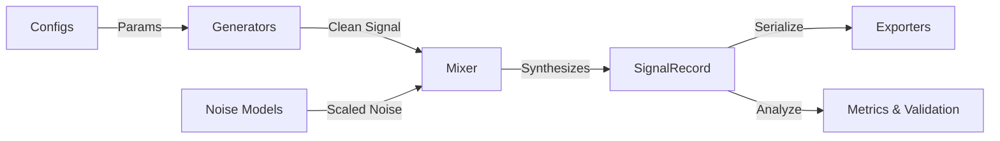

# 📖 BioSignal Simulator Library: Production-Grade Technical Reference Manual

Welcome to the official, production-grade technical reference manual for the **BioSignal Simulator Library (BSS)**. This manual provides an exhaustive, detail-oriented blueprint of the library's architecture, configurations, signal generators, noise models, composers, exporters, and analytical metrics.

---

## 🗺️ Table of Contents
1. **Library Core Architecture & Design Philosophy**
2. **Configuration API Reference (`biosignal_simulator/core/config.py`)**
3. **Signal Generation Reference (`biosignal_simulator/signals/`)**
4. **Noise Contamination Reference (`biosignal_simulator/noise/`)**
5. **Composers, Schedulers, and Injectors (`biosignal_simulator/composer/`)**
6. **Diagnostic Evaluation Metrics (`biosignal_simulator/metrics/`)**
7. **Symmetrical File Exporters & Importers (`biosignal_simulator/io/`)**
8. **Physiological Verification Engine (`biosignal_simulator/utils/validation.py`)**
9. **Grid Parameter Sweeps (`BenchmarkSuite`)**
10. **CLI Tool Reference (`bss`)**

---

## 🏛️ 1. Library Core Architecture & Design Philosophy

BSS is designed around a decoupled, **Configuration-Driven Pipeline**. The architecture separates data models, mathematical generators, temporal mixers, clinical loaders, and statistical verification.

### Core Lifecycle of a Signal Simulation


### Design Key Principles:
1. **No Machine Learning Dependencies**: Core operations rely on deterministic, classical DSP (digital signal processing) and mathematical models (SciPy/NumPy).
2. **Precision Preservation**: File imports and exports are symmetrical. Quantized biopotential signals (such as 12-bit/16-bit) read back from binary formats match original values within negligible precision bounds.
3. **Self-Validating Configuration Schemas**: Configuration classes use Python dataclasses with `__post_init__` hooks, preventing invalid states (e.g. sampling rates below Nyquist, negative frequencies, or out-of-bound heart rates).

---

## ⚙️ 2. Configuration API Reference (`core/config.py`)

All parameters are specified using type-annotated dataclasses.

### 2.1. Signal Configurations

#### `ECGConfig`
Represents the parameter set for McSharry ECGSYN electrocardiogram simulations.

* **Attributes**:
  * `fs` (`float`): Sampling frequency in Hz. Must be in range `[50.0, 5000.0]`. Default: `500.0`.
  * `duration_s` (`float`): Signal length in seconds. Must be positive. Default: `10.0`.
  * `heart_rate` (`float`): Target heart rate in beats per minute (BPM). Range: `[40.0, 200.0]`. Default: `75.0`.
  * `hr_variability_std` (`float`): R-to-R interval variance factor. Range: `[0.0, 0.5]`. Default: `0.05`.
  * `p_amplitude` (`float`): Atrial P-wave peak amplitude (mV). Range: `[0.0, 2.0]`. Default: `0.15`.
  * `qrs_amplitude` (`float`): QRS complex peak amplitude (mV). Range: `[0.3, 3.0]`. Default: `1.0`.
  * `t_amplitude` (`float`): Ventricular T-wave peak amplitude (mV). Range: `[0.0, 2.0]`. Default: `0.35`.
  * `qrs_width` (`float`): Width of QRS complex in seconds. Range: `[0.03, 0.25]`. Default: `0.08`.
  * `pr_interval` (`float`): PR segment duration in seconds. Range: `[0.08, 0.4]`. Default: `0.16`.
  * `st_elevation` (`float`): ST-segment shift in mV (for myocardial ischemia simulation). Range: `[-2.0, 2.0]`. Default: `0.0`.
  * `lead_type` (`str`): Lead format option: `'single'`, `'12lead'`, or `'vcg'`. Default: `'single'`.
  * `lead_name` (`str`): Specific lead output when using `'single'` mode. Range: Standard 12 leads (`'I'`, `'II'`, `'V5'`, etc.). Default: `'II'`.
  * `rhythm_type` (`str`): Arrhythmia classification: `'normal'`, `'afib'`, `'pvc'`, `'vtach'`, `'bradycardia'`, `'tachycardia'`, `'av_block'`. Default: `'normal'`.
  * `seed` (`Optional[int]`): Reproducibility seed. Default: `None`.

#### `EEGConfig`
Defines target resting rhythms and sleep/epileptic states.

* **Attributes**:
  * `fs` (`float`): Sampling frequency. Range: `[32.0, 4000.0]`. Default: `256.0`.
  * `duration_s` (`float`): Signal length. Must be positive. Default: `10.0`.
  * `band_powers` (`Dict[str, float]`): Dictionary of relative powers for brain bands: `'delta'`, `'theta'`, `'alpha'`, `'beta'`, `'gamma'`.
  * `background_1f_power` (`float`): Amplitude of $1/f$ pink noise background. Range: `[0.0, 1.0]`. Default: `0.3`.
  * `alpha_peak_hz` (`float`): Peak frequency of alpha rhythm. Range: `[6.0, 14.0]`. Default: `10.0`.
  * `n_channels` (`int`): Channels count. Range: `>= 1`. Default: `1`.
  * `corr_matrix` (`Optional[List[List[float]]]`): Spatial covariance matrix. Must be symmetric and positive-definite. Default: `None`.
  * `amplitude_uv` (`float`): RMS target scale in uV. Must be positive. Default: `50.0`.
  * `state` (`str`): Brain states: `'active'`, `'relaxed'`, `'n2_sleep'`, `'n3_sleep'`, `'tonic_clonic'`, `'absence'`, `'epileptiform_spikes'`. Default: `'relaxed'`.

#### `EMGConfig`
Defines intramuscular or surface motor unit potentials.

* **Attributes**:
  * `fs` (`float`): Sampling rate. Range: `[100.0, 10000.0]`. Default: `2000.0`.
  * `duration_s` (`float`): Signal duration. Must be positive. Default: `10.0`.
  * `fmin_hz` / `fmax_hz` (`float`): Bandpass frequency bounds. Must be below Nyquist.
  * `envelope_type` (`str`): Contraction envelope style: `'constant'`, `'ramp'`, `'burst'`. Default: `'constant'`.
  * `contraction_level` (`float`): Maximum activation factor. Range: `[0.0, 1.0]`. Default: `1.0`.
  * `amplitude_uv` (`float`): Target RMS voltage under full contraction. Default: `500.0`.
  * `emg_type` (`str`): `'surface'` or `'intramuscular'`. Default: `'surface'`.
  * `pathology` (`str`): `'normal'`, `'neuropathic'`, `'myopathic'`, `'als'`, `'myasthenia_gravis'`, `'parkinsons_tremor'`. Default: `'normal'`.

#### `PPGConfig`
Configures dual-channel infrared/red optical photoplethysmography.

* **Attributes**:
  * `fs` (`float`): Sampling rate. Range: `[10.0, 2000.0]`. Default: `100.0`.
  * `duration_s` (`float`): Duration in seconds. Default: `10.0`.
  * `heart_rate` (`float`): Target rate in bpm. Range: `[30.0, 220.0]`. Default: `75.0`.
  * `systolic_fraction` (`float`): Systolic wave width. Range: `(0, 0.6)`. Default: `0.25`.
  * `dicrotic_fraction` (`float`): Dicrotic wave width/amplitude factor. Range: `[0.0, 1.0]`. Default: `0.45`.
  * `resp_modulation` (`float`): Amplitude breathing modulation depth. Range: `[0.0, 0.8]`. Default: `0.15`.
  * `resp_rate` (`float`): Breathing modulation rate. Range: `(0.0, 2.0]`. Default: `0.25`.

#### `EDAConfig`
Defines skin conductance profiles.

* **Attributes**:
  * `fs` (`float`): Sampling rate. Range: `[1.0, 500.0]`. Default: `32.0`.
  * `duration_s` (`float`): Duration in seconds. Default: `60.0`.
  * `scl_amplitude_us` (`float`): Tonic baseline amplitude (uS). Default: `10.0`.
  * `scl_drift_rate` (`float`): Random walk drift slope. Default: `0.01`.
  * `event_rate_hz` (`float`): Phasic response trigger rate (Poisson process). Range: `[0, 5.0]`. Default: `0.2`.
  * `scr_rise_s` / `scr_decay_s` (`float`): Rise and decay times for phasic response templates.

#### `RespConfig`
Configures respiratory waveforms.

* **Attributes**:
  * `fs` (`float`): Sampling rate. Range: `[2.0, 1000.0]`. Default: `32.0`.
  * `duration_s` (`float`): Duration in seconds. Default: `60.0`.
  * `resp_rate_hz` (`float`): Base breathing frequency in Hz. Range: `[0.05, 2.0]`. Default: `0.25`.
  * `amplitude` (`float`): Peak wave amplitude. Default: `1.0`.
  * `harmonic_k` (`float`): Inhalation/exhalation ratio. Range: `[0.0, 0.9]`. Default: `0.3`.
  * `phase_noise_std` (`float`): Breathing rate variability std. Range: `[0.0, 0.5]`. Default: `0.1`.
  * `pattern` (`str`): Breath cycle pattern: `'normal'`, `'cheyne_stokes'`, `'biot'`, `'kussmaul'`. Default: `'normal'`.

---

### 2.2. Clinical Presets

The `ClinicalPresets` class offers pre-assembled, clinically validated configurations.

```python
from biosignal_simulator import ClinicalPresets

# Normal sinus rhythm 12-lead ECG config
normal_ecg_cfg = ClinicalPresets.get_normal_ecg(fs=500.0, duration_s=10.0)

# Epileptic tonic-clonic seizure EEG config
seizure_eeg_cfg = ClinicalPresets.get_seizure_eeg(fs=256.0, duration_s=30.0)

# Intramuscular EMG for ALS (Amyotrophic Lateral Sclerosis)
als_emg_cfg = ClinicalPresets.get_emg_als(fs=2000.0, duration_s=5.0)
```

---

## 📈 3. Signal Generation Reference (`signals/`)

Each generator class implements `generate() -> SignalRecord`.

### 3.1. ECG Generator (`ECGGenerator`)
* **Algorithm**: Implements the McSharry ECGSYN model. The state trajectory is solved in 3D using ODE integrations representing P, Q, R, S, and T waves as independent Gaussian kernels:
  $$\dot{\theta} = \omega$$
  $$\dot{x} = -\sum_{i} a_i \Delta \theta_i \exp\left(-\frac{\Delta \theta_i^2}{2 b_i^2}\right) - (x - x_0)$$
  $$\dot{y} = -\sum_{i} c_i \Delta \theta_i \exp\left(-\frac{\Delta \theta_i^2}{2 d_i^2}\right) - (y - y_0)$$
  $$\dot{z} = -\sum_{i} z_i \exp\left(-\frac{\Delta \theta_i^2}{2 f_i^2}\right) - (z - z_0(t))$$
* **12-Lead Projection**: Projects the 3D VCG trajectory $(x, y, z)$ into 12 standard clinical leads using the Dower Matrix:
  $$\mathbf{V}_{12} = \mathbf{D} \cdot \mathbf{X}_{vcg}$$

```python
from biosignal_simulator import ECGGenerator, ECGConfig

generator = ECGGenerator(ECGConfig(lead_type='12lead', duration_s=5.0))
record = generator.generate()
# record.clean has shape (12, 2500)
```

### 3.2. EEG Generator (`EEGGenerator`)
* **Algorithm**: Rhythms are generated using spectral bandpass filtering of Gaussian white noise. The $1/f$ pink noise background is generated using Voss-McCartney fractional integration. Multi-channel spatial correlation mixes channels:
  $$\mathbf{S}_{correlated} = \mathbf{L} \cdot \mathbf{S}_{independent}$$
  where $\mathbf{L}$ is the Cholesky lower triangular factor of the target covariance matrix ($\mathbf{\Sigma} = \mathbf{L}\mathbf{L}^T$).
* **Transients**: Sleep spindles are added as Gaussian-windowed sine waves at $11\text{--}16\text{ Hz}$. K-complexes are added as biphasic solitary waves.

```python
from biosignal_simulator import EEGGenerator, EEGConfig
import numpy as np

# Spatial mixing for 3-channel EEG
cov = np.array([[1.0, 0.5, 0.3], [0.5, 1.0, 0.4], [0.3, 0.4, 1.0]])
generator = EEGGenerator(EEGConfig(n_channels=3, corr_matrix=cov.tolist(), state='n2_sleep'))
record = generator.generate()
```

### 3.3. EMG Generator (`EMGGenerator`)
* **Algorithm**: Uses a Motor Unit Action Potential (MUAP) template shaped as a triphasic wave:
  $$MUAP(t) = A \cdot \left(1 - 4\pi^2 f_0^2 t^2\right) e^{-2\pi^2 f_0^2 t^2}$$
  The signal is generated by convolving MUAP templates with Poisson impulse trains representing motor unit firing times.
* **Fatigue Model**: Drifts the spectral profile downward over time by compressing the time-axis of MUAP templates.

```python
from biosignal_simulator import EMGGenerator, EMGConfig

generator = EMGGenerator(EMGConfig(mode='surface', pathology='als'))
record = generator.generate()
```

### 3.4. PPG Generator (`PPGGenerator`)
* **Algorithm**: Cardiac pulses are modeled using a 3-Gaussian template matching the systolic peak, dicrotic notch, and diastolic peak:
  $$PPG_{cycle}(t) = \sum_{i=1}^3 A_i \exp\left(-\frac{(t - t_i)^2}{2 \sigma_i^2}\right)$$
  Respiratory Sinus Arrhythmia (RSA) modulates both the timing (via heart rate variance) and amplitude of the PPG cycles.

```python
from biosignal_simulator import PPGGenerator, PPGConfig

generator = PPGGenerator(PPGConfig(resp_modulation=0.2))
record = generator.generate()
```

### 3.5. EDA Generator (`EDAGenerator`)
* **Algorithm**: Models Tonic Skin Conductance (SCL) as a drift random walk:
  $$SCL(t) = SCL_0 + \mu t + \sigma W(t)$$
  Phasic responses (SCRs) are generated by convolving a Poisson trigger sequence with a bi-exponential impulse response function:
  $$SCR_{impulse}(t) = \left(e^{-t/\tau_d} - e^{-t/\tau_r}\right) \cdot U(t)$$

```python
from biosignal_simulator import EDAGenerator, EDAConfig

generator = EDAGenerator(EDAConfig(event_rate_hz=0.3))
record = generator.generate()
```

### 3.6. Respiration Generator (`RespGenerator`)
* **Algorithm**: Generates respiration cycles with asymmetric inhalation and exhalation profiles:
  $$Resp(t) = \sin\left(\omega t + \phi(t) + k \cdot \sin(2\omega t)\right)$$
  where $k$ introduces breathing asymmetry. Pathological states (such as Cheyne-Stokes) are simulated by multiplying the respiration signal by a low-frequency amplitude modulation envelope.

```python
from biosignal_simulator import RespGenerator, RespConfig

generator = RespGenerator(RespConfig(pattern='cheyne_stokes'))
record = generator.generate()
```

---

## 🔊 4. Noise Contamination Reference (`noise/`)

All noise models inherit from `BaseNoiseModel` and implement:
`generate_scaled(signal: np.ndarray, target_snr_db: float) -> np.ndarray`

This method scales the noise vector $\mathbf{n}$ such that the ratio of signal power to noise power matches the target SNR in decibels:
$$\mathbf{n}_{scaled} = \mathbf{n} \cdot 10^{-\frac{SNR_{dB}}{20}} \cdot \frac{\text{RMS}(\mathbf{s})}{\text{RMS}(\mathbf{n})}$$

### 4.1. The 10 Physical Noise Models

1. **`GaussianNoise`**: Generates additive white Gaussian noise (AWGN).
   * **Parameters**: `std` (`float`), `mean` (`float`).
2. **`ColoredNoise`**: Generates $1/f^\alpha$ power-law spectral noise. Supports Pink ($\alpha=1$), Brown ($\alpha=2$), Blue ($\alpha=-1$), and Violet ($\alpha=-2$) noise profiles.
   * **Parameters**: `exponent` (`float`), `method` (`str`: `'fft'` or `'voss'`).
3. **`BaselineWander`**: Simulates low-frequency baseline drifts (e.g. from respiration or patient movement).
   * **Parameters**: `wander_freq` (`float`), `amplitude` (`float`).
4. **`PowerlineNoise`**: Simulates 50 Hz or 60 Hz mains interference, including harmonic decay, amplitude modulation, and line phase drift.
   * **Parameters**: `f_line_hz` (`float`), `n_harmonics` (`int`), `harmonic_decay` (`float`).
5. **`MotionArtifact`**: Generates low-frequency drift and sharp transient shifts caused by sensor movement or cable rubbing.
   * **Parameters**: `lf_amplitude` (`float`), `impact_rate_hz` (`float`), `cable_amplitude` (`float`).
6. **`ElectrodeNoise`**: Models loose contacts (popcorn noise) and Johnson-Nyquist thermal noise.
   * **Parameters**: `popcorn_amplitude` (`float`), `impedance_ohms` (`float`).
7. **`EMGArtifact`**: Simulates biopotential contamination from nearby muscle activity.
   * **Parameters**: `burst_rate_hz` (`float`), `burst_duration_s` (`float`).
8. **`ImpulseNoise`**: Generates heavy-tailed impulse spikes modeled with a generalized Pareto distribution.
   * **Parameters**: `rate_hz` (`float`), `amplitude_scale` (`float`).
9. **`QuantizationNoise`**: Simulates analog-to-digital converter (ADC) quantization error. Supports optional dither.
   * **Parameters**: `n_bits` (`int`), `v_range` (`float`), `dither` (`bool`).
10. **`WearableNoise`**: Combines sensor detachment (flatlining with initial transient spikes), optical light leakage (for PPG sensors), and wireless packet drops (with interpolation recovery).
    * **Parameters**: `detachment_time_s` (`float`), `leakage_amplitude` (`float`), `loss_rate` (`float`).

```python
from biosignal_simulator import GaussianNoise, ColoredNoise
import numpy as np

signal = np.sin(2 * np.pi * 5.0 * np.linspace(0, 10, 1000))

# Mix white noise targeting 15 dB SNR
white_noise = GaussianNoise()
scaled_noise = white_noise.generate_scaled(signal, target_snr_db=15.0)
noisy_signal = signal + scaled_noise
```

---

## 🎛️ 5. Composers, Schedulers, and Injectors (`composer/`)

Composers mix multiple signal and noise sources into a single composite record.

### 5.1. `SignalMixer`
Mixes a clean signal with multiple noise models, applying target SNR scaling globally or channel-wise.

```python
from biosignal_simulator import SignalMixer, ECGGenerator, ECGConfig, GaussianNoise, PowerlineNoise

# Setup signal and noises
generator = ECGGenerator(ECGConfig(fs=250, duration_s=10))
noises = [GaussianNoise(std=0.1), PowerlineNoise(f_line_hz=50.0, amplitude=0.05)]

# Mix targeting a composite global SNR of 18 dB
mixer = SignalMixer(signal_generator=generator, noise_models=noises, target_snr_db=18.0)
record = mixer.mix()
```

### 5.2. `NoiseScheduler`
Applies time-varying amplitude envelopes to noise models.

* **Supported Envelopes**:
  * `StepSchedule`: Changes the noise level abruptly at a specific timestamp.
  * `RampSchedule`: Linearly ramps the noise level between two bounds.
  * `PeriodicSchedule`: Modulates the noise level using a sine wave.

```python
from biosignal_simulator import NoiseScheduler, ColoredNoise, RampSchedule

pink_noise = ColoredNoise(exponent=1.0)
# Ramp noise amplitude from 0.0 to 0.5 over 10 seconds
scheduler = NoiseScheduler(
    noise_model=pink_noise,
    envelope=RampSchedule(start_val=0.0, end_val=0.5, duration_s=10.0)
)
```

### 5.3. `ArtifactInjector`
Injects short transient noise events (e.g. motion bursts) at specific timestamps, using Tukey windows to fade the noise in and out smoothly.

```python
from biosignal_simulator import ArtifactInjector, MotionArtifact, MotionArtifactConfig

config = MotionArtifactConfig(impact_amplitude=1.5, enable_impacts=True)
motion_noise = MotionArtifact(config)

# Inject motion noise at the 4.0 second mark for a duration of 1.5 seconds
injector = ArtifactInjector(
    artifact_generator=motion_noise,
    onset_s=4.0,
    duration_s=1.5
)
```

---

## 📊 6. Diagnostic Evaluation Metrics (`metrics/`)

Evaluate signal quality and distortion compared to clean baselines using multiple standard metrics.

### 6.1. SNR Evaluation
* **Wideband SNR**: Standard SNR calculated over the full bandwidth:
  $$SNR_{wideband} = 10 \log_{10} \left( \frac{\sum s[n]^2}{\sum (y[n] - s[n])^2} \right)$$
* **Segmental SNR**: Calculates the average SNR across short sliding windows:
  $$SNR_{seg} = \frac{1}{M} \sum_{m=0}^{M-1} 10 \log_{10} \left( \frac{\sum_{k=0}^{N-1} s[mN + k]^2}{\sum_{k=0}^{N-1} (y[mN + k] - s[mN + k])^2} \right)$$
* **Discrete Wavelet transform (DWT) SNR**: Evaluates SNR within specific wavelet subbands (e.g., using a Haar filter bank).

### 6.2. Spectral Rhythms
* **Mean Frequency (MNF)**:
  $$MNF = \frac{\sum_{i} f_i P(f_i)}{\sum_{i} P(f_i)}$$
* **Median Frequency (MDF)**: The frequency that divides the power spectrum into two equal halves:
  $$\sum_{i=0}^{MDF} P(f_i) = \sum_{i=MDF}^{N} P(f_i)$$
* **Spectral Edge Frequency (SEF95)**: The frequency below which 95% of the spectral power is concentrated.

### 6.3. Morphological Distortion
* **Percent Residual Difference (PRD)**:
  $$PRD = \sqrt{\frac{\sum (s[n] - y[n])^2}{\sum s[n]^2}} \times 100\%$$
* **1D Structural Similarity Index (SSIM)**: Compares local luminance, contrast, and structure between waveforms.
* **QRS Template Correlation**: Measures morphological correlation of QRS complexes after peak alignment.

```python
from biosignal_simulator.metrics.snr import compute_snr_wideband
from biosignal_simulator.metrics.distortion import compute_ssim_1d

# Assuming `clean` and `noisy` arrays exist
snr_db = compute_snr_wideband(clean, noisy, fs=500.0)
ssim_score = compute_ssim_1d(clean, noisy)
```

---

## 💾 7. Symmetrical File Exporters & Importers (`io/`)

BSS provides importers and exporters that convert between internal memory arrays and standard clinical storage formats without loss of signal precision.

```
                  ┌─────────────────────────────────────────┐
                  │              SignalRecord               │
                  └────────────────────┬────────────────────┘
                                       │
            ┌──────────────────────────┼──────────────────────────┐
            ▼                          ▼                          ▼
 ┌─────────────────────┐    ┌─────────────────────┐    ┌─────────────────────┐
 │    EDF-Lite File    │    │      WFDB File      │    │    HDF5 / pandas    │
 └─────────────────────┘    └─────────────────────┘    └─────────────────────┘
```

### 7.1. European Data Format (EDF)
* **API**: `BiosignalExporter.export_edf(record, path)` and `BiosignalImporter.import_edf(path)`
* **Details**: Writes standard EDF+ files, mapping signal amplitudes to 16-bit integer quantization ranges while preserving clinical header metadata.

### 7.2. PhysioNet WFDB Format
* **Format 16**: Standard 16-bit signed integer representation.
* **Format 212**: Interleaved 12-bit representation (three bytes contain two samples across channels). BSS handles these bit-packing operations transparently.
* **API**:
  * `BiosignalExporter.export_wfdb(record, path, format='16')`
  * `BiosignalImporter.import_wfdb(path)`

### 7.3. HDF5, CSV, and MAT Formats
* **HDF5**: Saves multi-channel signals, noise components, and configuration parameters in a structured, compressed HDF5 hierarchy.
* **CSV**: Exports signals as text tables, including configuration details formatted as JSON comment blocks in the header.
* **MAT**: Generates MATLAB-compatible `.mat` files containing signal structures.

```python
from biosignal_simulator import ECGGenerator, ECGConfig
from biosignal_simulator.io import BiosignalExporter, BiosignalImporter

record = ECGGenerator(ECGConfig()).generate()

# Symmetrical EDF Export/Import
BiosignalExporter.export_edf(record, "subject_data.edf")
imported_rec = BiosignalImporter.import_edf("subject_data.edf")

# Symmetrical WFDB Format 212 Export/Import
BiosignalExporter.export_wfdb(record, "subject_data_212", format="212")
imported_wfdb = BiosignalImporter.import_wfdb("subject_data_212")
```

---

## 🔍 8. Physiological Verification Engine (`utils/validation.py`)

The validation engine evaluates signal quality, flags recording issues, and generates clinical summary reports.

### 8.1. `SignalIntegrityChecker`
Checks signals for recording issues:
* **Flatline Segment Locator**: Detects signal flatlines by searching for constant-voltage segments longer than a target duration threshold.
* **Clipping Detector**: Identifies signal saturation/clipping by measuring the ratio of samples that rest at maximum/minimum amplitudes.
* **Harmonic Line Noise Detector**: Estimates line noise contamination by calculating the signal power at 50/60 Hz and their harmonics.

### 8.2. `PhysiologicalValidator`
Extracts physiological parameters using classical signal processing algorithms:
* **Pan-Tompkins QRS Detector**: Detects QRS complexes in ECG signals using bandpass filtering, differentiation, squaring, and moving-window integration.
* **Respiration Zero-Crossing Estimator**: Estimates breathing rates by counting zero-crossings in filtered respiration signals.
* **EEG Relative Spectral Band Integration**: Computes power ratios across brain wave bands (alpha, beta, theta, delta, gamma).

```python
from biosignal_simulator.utils.validation import validate_signal

# Analyze a record and generate an HTML report
validation_report = validate_signal(record)
validation_report.export_html("report.html")

print(f"Report Status: {'Clean' if not validation_report.has_errors else 'Warnings Found'}")
```

---

## 🎚️ 9. Grid Parameter Sweeps (`BenchmarkSuite`)

`BenchmarkSuite` runs grid sweeps across multiple signal and noise parameters to profile how DSP algorithms or filters perform under different conditions.

```python
import numpy as np
from scipy.signal import butter, filtfilt
from biosignal_simulator import ECGGenerator, GaussianNoise, BenchmarkSuite

# 1. Define high-pass filter function
def bss_highpass(signal_array, fs):
    nyq = 0.5 * fs
    b, a = butter(3, 0.5 / nyq, btype='highpass')
    return filtfilt(b, a, signal_array)

# 2. Configure parameter sweep grid
suite = BenchmarkSuite(
    signal_class=ECGGenerator,
    noise_class=GaussianNoise,
    signal_param_grid={'heart_rate': [60.0, 80.0, 100.0], 'fs': [250.0]},
    noise_param_grid={'std': [0.05, 0.1, 0.25]},
    metrics=['snr_wideband', 'rmse', 'correlation'],
    filter_fn=bss_highpass
)

# 3. Run the sweep and return results as a pandas DataFrame
df_results = suite.run()
print(df_results.head(10))
```

#### Expected Output Dataframe Structure
| sig_heart_rate | noise_std | fs | snr_in | snr_wideband | rmse | correlation |
| :--- | :--- | :--- | :--- | :--- | :--- | :--- |
| 60.0 | 0.05 | 250.0 | 25.12 | 26.24 | 0.0054 | 0.9982 |
| 60.0 | 0.10 | 250.0 | 19.34 | 20.45 | 0.0102 | 0.9954 |
| 60.0 | 0.25 | 250.0 | 11.23 | 12.12 | 0.0245 | 0.9812 |
| 80.0 | 0.05 | 250.0 | 24.89 | 25.92 | 0.0056 | 0.9981 |
| ... | ... | ... | ... | ... | ... | ... |

---

## 💻 10. CLI Reference Suite (`bss`)

BSS includes a command-line interface with six built-in commands.

### 10.1. `bss generate`
Generates physiological signals and exports them to files.

```bash
# Generate 10 seconds of ECG data at 250 Hz and export to HDF5
bss generate --type ecg --duration 10 --fs 250 --output ecg_record.h5
```

### 10.2. `bss validate`
Runs signal integrity and physiological checks on a file.

```bash
# Run integrity validation on a CSV file and output an HTML report
bss validate --file subject_data.csv --html-report validation_log.html
```

### 10.3. `bss sweep`
Runs parameter sweeps to evaluate filtering performance.

```bash
# Run a parameter sweep and output the benchmark metrics to a CSV file
bss sweep --param heart_rate --values "60,80,120" --noise-std 0.1 --output sweep_results.csv
```

### 10.4. `bss interactive`
Launches an interactive terminal-based configuration wizard to build signals step-by-step.

```bash
bss interactive
```

### 10.5. `bss plot`
Generates static diagnostic visualization plots of signals.

```bash
# Save an ECG grid plot image from a saved HDF5 record
bss plot --file ecg_record.h5 --output ecg_grid.png
```

### 10.6. `bss list`
Lists all available signal generators, noise models, configurations, and analytical metrics.

```bash
bss list
```
