# BioSignal Simulator — Complete Reference Manual

> **Version**: 0.1.1 | **Python**: ≥ 3.9 | **License**: MIT
>
> `pip install biosignal-simulator`

---

## Table of Contents

1. [Introduction & Philosophy](#1-introduction--philosophy)
2. [Installation & Dependencies](#2-installation--dependencies)
3. [Architecture Overview](#3-architecture-overview)
4. [Configuration System](#4-configuration-system)
   - 4.1 [ECGConfig](#41-ecgconfig)
   - 4.2 [EEGConfig](#42-eegconfig)
   - 4.3 [EMGConfig](#43-emgconfig)
   - 4.4 [PPGConfig](#44-ppgconfig)
   - 4.5 [EDAConfig](#45-edaconfig)
   - 4.6 [RespConfig](#46-respconfig)
   - 4.7 [Noise Configuration Classes](#47-noise-configuration-classes)
   - 4.8 [Wearable Condition Configurations](#48-wearable-condition-configurations)
   - 4.9 [ConfigSerializer](#49-configserializer)
5. [Signal Generators](#5-signal-generators)
   - 5.1 [ECGGenerator](#51-ecggenerator)
   - 5.2 [EEGGenerator](#52-eeggenerator)
   - 5.3 [EMGGenerator](#53-emggenerator)
   - 5.4 [PPGGenerator](#54-ppggenerator)
   - 5.5 [EDAGenerator](#55-edagenerator)
   - 5.6 [RespGenerator](#56-respgenerator)
6. [Noise Models](#6-noise-models)
   - 6.1 [GaussianNoise](#61-gaussiannoise)
   - 6.2 [ColoredNoise / PinkNoise / BrownNoise / BlueNoise / VioletNoise](#62-colorednoise--pinknoise--brownnoise--bluenoise--violetnoise)
   - 6.3 [BaselineWander](#63-baselinewander)
   - 6.4 [PowerlineNoise](#64-powerlinenoise)
   - 6.5 [MotionArtifact](#65-motionartifact)
   - 6.6 [ElectrodeNoise](#66-electrodenoise)
   - 6.7 [EMGArtifact](#67-emgartifact)
   - 6.8 [ImpulseNoise](#68-impulsenoise)
   - 6.9 [QuantizationNoise](#69-quantizationnoise)
   - 6.10 [CrosstalkNoise](#610-crosstalkNoise)
7. [Wearable Artifact Models](#7-wearable-artifact-models)
   - 7.1 [SensorDetachmentNoise](#71-sensordetachmentnoise)
   - 7.2 [ElectrodeDisplacementNoise](#72-electrodedisplacementnoise)
   - 7.3 [LightLeakageNoise](#73-lightleakagenoise)
   - 7.4 [PacketLossNoise](#74-packetlossnoise)
8. [Composer Pipeline](#8-composer-pipeline)
   - 8.1 [SignalMixer](#81-signalmixer)
   - 8.2 [NoiseScheduler](#82-noisescheduler)
   - 8.3 [ArtifactInjector](#83-artifactinjector)
   - 8.4 [SNRController](#84-snrcontroller)
9. [SignalRecord](#9-signalrecord)
10. [Quality Metrics](#10-quality-metrics)
    - 10.1 [SNR Metrics](#101-snr-metrics)
    - 10.2 [Distortion Metrics](#102-distortion-metrics)
    - 10.3 [Spectral Metrics](#103-spectral-metrics)
11. [I/O and Export](#11-io-and-export)
12. [Command-Line Interface (CLI)](#12-command-line-interface-cli)
13. [Advanced Usage Patterns](#13-advanced-usage-patterns)
    - 13.1 [Parameter Sweeps and Benchmarking](#131-parameter-sweeps-and-benchmarking)
    - 13.2 [Multi-Signal Composite Recordings](#132-multi-signal-composite-recordings)
    - 13.3 [Dynamic SNR Scheduling](#133-dynamic-snr-scheduling)
    - 13.4 [Reproducibility and Seeding](#134-reproducibility-and-seeding)
    - 13.5 [Baseline Correction Methods](#135-baseline-correction-methods)
    - 13.6 [Resampling and Interpolation](#136-resampling-and-interpolation)
14. [Design Reference: Physiological Models](#14-design-reference-physiological-models)
    - 14.1 [ECG: VCG Dipole Model & Dower Projection](#141-ecg-vcg-dipole-model--dower-projection)
    - 14.2 [EEG: Power-Law Band Composition](#142-eeg-power-law-band-composition)
    - 14.3 [EMG: Motor Unit Activation Model](#143-emg-motor-unit-activation-model)
    - 14.4 [PPG: Optical Vascular Model](#144-ppg-optical-vascular-model)
    - 14.5 [EDA: SCL-SCR Two-Component Model](#145-eda-scl-scr-two-component-model)
    - 14.6 [Respiration: Harmonic Oscillator](#146-respiration-harmonic-oscillator)
15. [API Quick Reference](#15-api-quick-reference)
16. [Validation Against Clinical Norms](#16-validation-against-clinical-norms)
17. [Extending the Library](#17-extending-the-library)
18. [Testing](#18-testing)
19. [Contributing](#19-contributing)
20. [References](#20-references)

---

## 1. Introduction & Philosophy

**BioSignal Simulator** (`biosignal-simulator`) is a research-grade Python library for synthesizing physiologically realistic bioelectrical and biophysical signals. It is designed to serve as a gold-standard ground-truth data generator for:

- Training and benchmarking **machine learning classifiers** for arrhythmia detection, seizure identification, and motion artifact rejection.
- Evaluating **signal processing algorithms** (filters, denoising, baseline removal) under precisely controlled noise conditions.
- Generating **synthetic training datasets** that augment scarce clinical recordings.
- Creating **unit-tested reference signals** for embedded DSP firmware validation.
- Studying the **impact of wearable sensor conditions** (sensor detachment, packet loss, light leakage) on downstream analytics.

### Design Philosophy

The library is built around five core principles:

1. **Physiological Accuracy First**: Every generator is derived from peer-reviewed biophysical models. ECG uses the Dower VCG projection; EEG uses empirically calibrated band-power spectral models; EMG uses a bandpass-filtered motor unit firing model. Parameters are validated against clinical ranges.

2. **Configuration-Driven Architecture**: Every aspect of generation is controlled by an immutable, serializable dataclass configuration. This enables reproducibility, batch sweeping, YAML/JSON import/export, and makes parameters self-documenting.

3. **Composable Noise Pipeline**: Clean signals and noise models are independent layers. The `SignalMixer` orchestrates a physical cascade of additive, transient, and discretization noise, supporting SNR targeting, time-varying noise schedules, and composite multi-source recordings.

4. **First-Class I/O**: The `SignalRecord` container holds clean and noisy arrays, configuration metadata, noise components, and quality metrics in a single, serializable structure. Export to EDF, HDF5, CSV, WFDB, JSON, and NumPy NPZ is supported out-of-the-box.

5. **Zero Configuration Defaults**: Every generator and noise model works with sensible clinical defaults. A minimal two-line script produces a realistic 10-second ECG.

### Supported Signal Modalities

| Modality | Class | Typical fs | Key Parameters |
|----------|-------|-----------|----------------|
| Electrocardiogram (ECG) | `ECGGenerator` | 100–2000 Hz | Heart rate, arrhythmia type, 12-lead |
| Electroencephalogram (EEG) | `EEGGenerator` | 128–1024 Hz | Brain state, band powers, n_channels |
| Electromyogram (EMG) | `EMGGenerator` | 500–4000 Hz | Pathology, envelope type |
| Photoplethysmogram (PPG) | `PPGGenerator` | 25–500 Hz | Heart rate, dicrotic wave |
| Electrodermal Activity (EDA) | `EDAGenerator` | 4–64 Hz | SCL amplitude, SCR event rate |
| Respiration | `RespGenerator` | 4–128 Hz | Breathing rate, asymmetry |

### Supported Noise/Artifact Models

| Category | Model | Physical Basis |
|----------|-------|----------------|
| Additive | `GaussianNoise` | AWGN (thermal amplifier noise) |
| Additive | `PinkNoise`, `BrownNoise`, `BlueNoise` | 1/f spectral noise |
| Additive | `BaselineWander` | Respiration chest movement |
| Additive | `PowerlineNoise` | 50/60 Hz AC mains interference |
| Additive | `MotionArtifact` | LF body motion + impact transients |
| Additive | `ElectrodeNoise` | Thermal Johnson + popcorn noise |
| Additive | `EMGArtifact` | Muscle artifact on ECG/EEG |
| Additive | `ImpulseNoise` | Spike/popcorn transients |
| Additive | `CrosstalkNoise` | Physiological leakage between channels |
| Non-linear | `SensorDetachmentNoise` | Lead-off event with transient spike |
| Non-linear | `ElectrodeDisplacementNoise` | DC offset jumps from loose contacts |
| Non-linear | `LightLeakageNoise` | Ambient light into PPG photodetector |
| Non-linear | `PacketLossNoise` | Wireless dropout with fill strategy |
| Non-linear | `QuantizationNoise` | ADC discretization and dithering |

---

## 2. Installation & Dependencies

### PyPI Installation (Recommended)

```bash
pip install biosignal-simulator
```

All required dependencies are installed automatically:

| Package | Minimum Version | Purpose |
|---------|-----------------|---------|
| `numpy` | ≥ 1.24.0 | Array operations, FFT |
| `scipy` | ≥ 1.10.0 | Signal processing, statistics, IIR filters |
| `pandas` | ≥ 2.0.0 | DataFrame export, CSV I/O |
| `h5py` | ≥ 3.8.0 | HDF5 file format I/O |
| `matplotlib` | ≥ 3.7.0 | Built-in visualization |
| `pyyaml` | ≥ 6.0.0 | YAML config serialization |

### Development Installation

```bash
git clone https://github.com/therajpoots/Biosim.git
cd Biosim
pip install -e ".[dev]"
```

### Verify Installation

```python
import biosignal_simulator as bss
print(bss.__version__)         # "0.1.1"
print(bss.list_generators())   # ['ecg', 'eeg', 'emg', 'ppg', 'eda', 'resp']
```

### Quick Smoke Test

```python
from biosignal_simulator import ECGGenerator, ECGConfig

gen = ECGGenerator(ECGConfig(fs=500, duration_s=5, heart_rate=72, seed=42))
signal = gen.generate()
print(signal.shape)            # (2500,)
print(signal.min(), signal.max())  # ~ -0.4, 1.2 mV
```

---

## 3. Architecture Overview

```
biosignal_simulator/
├── core/
│   ├── base.py          ← BaseSignal, BaseNoiseModel, SignalRegistry metaclass
│   ├── config.py        ← All configuration dataclasses (ECGConfig, EEGConfig, ...)
│   ├── record.py        ← SignalRecord: the universal output container
│   └── math_utils.py    ← RMS, SNR, SSIM, entropy, spectral utilities
├── signals/
│   ├── ecg.py           ← ECGGenerator, BeatEventGenerator, VCG dipole model
│   ├── eeg.py           ← EEGGenerator, brain state spectral shaping
│   ├── emg.py           ← EMGGenerator, motor unit firing model
│   ├── ppg.py           ← PPGGenerator, optical pulse model
│   ├── eda.py           ← EDAGenerator, tonic+phasic SCL/SCR model
│   └── resp.py          ← RespGenerator, harmonic oscillator model
├── noise/
│   ├── gaussian.py      ← GaussianNoise (AWGN)
│   ├── colored.py       ← ColoredNoise, PinkNoise, BrownNoise, BlueNoise, VioletNoise
│   ├── baseline.py      ← BaselineWander (respiratory + drift + trend)
│   ├── powerline.py     ← PowerlineNoise (50/60 Hz + harmonics)
│   ├── motion.py        ← MotionArtifact (LF + impact + cable)
│   ├── electrode.py     ← ElectrodeNoise (Johnson thermal + popcorn)
│   ├── emg_artifact.py  ← EMGArtifact (contamination of other channels)
│   ├── impulse.py       ← ImpulseNoise (Gamma-distributed spikes)
│   ├── quantization.py  ← QuantizationNoise (ADC roundoff + dither)
│   ├── crosstalk.py     ← CrosstalkNoise (physiological coupling)
│   └── wearable.py      ← SensorDetachment, ElectrodeDisplacement,
│                           LightLeakage, PacketLoss
├── composer/
│   ├── mixer.py         ← SignalMixer: orchestrates the full pipeline
│   ├── scheduler.py     ← NoiseScheduler: time-varying noise envelopes
│   ├── artifact_injector.py ← ArtifactInjector: event-based artifact insertion
│   └── snr_controller.py    ← SNRController, DynamicSNRController
├── metrics/
│   ├── snr.py           ← compute_snr_wideband/segmental/spectral/wavelet/adaptive
│   ├── distortion.py    ← compute_prd, compute_ssim_1d, compute_mse
│   └── spectral.py      ← compute_mean_frequency, compute_spectral_entropy, bandpower
├── io/
│   ├── exporters.py     ← BiosignalExporter (EDF, HDF5, CSV, WFDB, NPZ, JSON)
│   └── loaders.py       ← BiosignalLoader (import from file formats)
├── utils/
│   ├── validation.py    ← validate_config, validate_array, range_checks
│   └── visualization.py ← plot_signal, plot_spectrum, plot_snr_heatmap
└── cli.py               ← bss CLI (generate, validate, sweep, plot, list)
```

### Data Flow Diagram

```
┌──────────────┐     ┌─────────────────┐
│  ECGConfig   │────▶│  ECGGenerator   │
│  EEGConfig   │     │  EEGGenerator   │──▶ clean np.ndarray
│  EMGConfig   │     │  EMGGenerator   │    (1D or 2D)
└──────────────┘     └─────────────────┘
                              │
                    ┌─────────▼──────────┐
┌──────────────┐    │    SignalMixer     │
│  NoiseConfigs│───▶│  ┌─────────────┐  │
│ (10+ models) │    │  │ SNRController│  │
└──────────────┘    │  │ Scheduler   │  │
                    │  │ Artifact    │  │
                    │  └─────────────┘  │
                    └─────────┬──────────┘
                              │
                    ┌─────────▼──────────┐
                    │   SignalRecord     │──▶ .clean, .noisy
                    │  ┌──────────────┐ │    .noise_components
                    │  │  Metadata    │ │    .quality_metrics
                    │  │  UUID + ts   │ │    .quality_flags
                    │  └──────────────┘ │    .snr_db
                    └─────────┬──────────┘
                              │
          ┌───────────────────┼───────────────────┐
          ▼                   ▼                   ▼
   BiosignalExporter    Metrics API         CLI (bss)
  (EDF/HDF5/CSV/WFDB)  (SNR/SSIM/PRD)   (generate/plot)
```

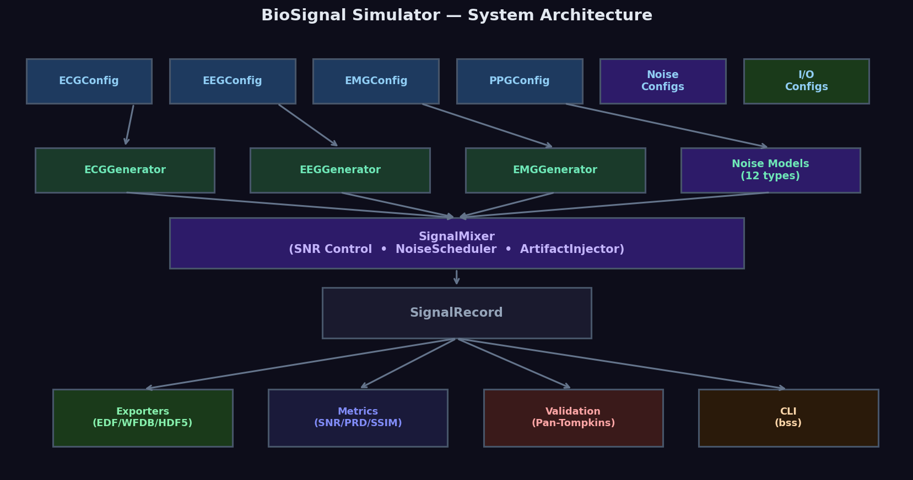

---

## 4. Configuration System

All generator parameters are encapsulated in **frozen-field dataclasses** that validate inputs on construction. Attempting to set an out-of-range value raises a descriptive `ValueError` that lists every failing constraint simultaneously.

### Design Rationale

- **Immutability**: Config objects should not be mutated after construction. Use `copy.deepcopy()` or `sweep_config()` to create variants.
- **Self-documenting defaults**: Every field has a type annotation and default value matching the physiological "typical resting" condition.
- **Serializable**: `ConfigSerializer.to_json()`, `.to_yaml()`, `.to_dict()` roundtrip configs losslessly.

---

### 4.1 ECGConfig

Controls all parameters of the vectorcardiographic ECG generator.

```python
from biosignal_simulator.core.config import ECGConfig
```

```python
@dataclass
class ECGConfig:
    fs: float = 500.0              # Sampling frequency in Hz [50, 5000]
    duration_s: float = 10.0      # Signal duration in seconds (> 0)
    heart_rate: float = 75.0      # Heart rate in BPM [40, 200]
    hr_variability_std: float = 0.05  # HRV: fractional RR std dev [0, 0.5]
    p_amplitude: float = 0.15     # P-wave amplitude in mV [0, 2.0]
    qrs_amplitude: float = 1.0    # QRS peak amplitude in mV [0.3, 3.0]
    t_amplitude: float = 0.35     # T-wave amplitude in mV [0, 2.0]
    qrs_width: float = 0.08       # QRS complex duration in seconds [0.03, 0.25]
    pr_interval: float = 0.16     # PR interval in seconds [0.08, 0.4]
    st_elevation: float = 0.0     # ST elevation/depression in mV [-2.0, 2.0]
    lead_type: str = 'single'     # Output mode: 'single', '12lead', 'vcg'
    lead_name: str = 'II'         # Lead name for single mode
    rhythm_type: str = 'normal'   # Arrhythmia type (see below)
    seed: Optional[int] = None    # RNG seed for reproducibility
```

**Allowed `rhythm_type` values:**

| Value | Description |
|-------|-------------|
| `'normal'` | Normal Sinus Rhythm (NSR) |
| `'bradycardia'` | HR < 60 BPM (slow sinus rhythm) |
| `'tachycardia'` | HR > 100 BPM (fast sinus rhythm) |
| `'afib'` | Atrial Fibrillation (irregular, no P-waves, f-waves) |
| `'aflutter'` | Atrial Flutter (sawtooth F-waves, 2:1 or 4:1 AV block) |
| `'pvc'` | Premature Ventricular Contractions (ectopic wide QRS) |
| `'pac'` | Premature Atrial Contractions (early narrow QRS) |
| `'vtach'` | Ventricular Tachycardia (≥3 consecutive PVCs, rate > 100) |
| `'vfib'` | Ventricular Fibrillation (chaotic, no organized QRS) |
| `'av_block'` | Second-degree AV Block Mobitz II (fixed PR, dropped QRS) |
| `'wenckebach'` | Second-degree AV Block Mobitz I (progressive PR lengthening) |
| `'complete_av_block'` | Third-degree AV block (complete P/QRS dissociation) |
| `'rbbb'` | Right Bundle Branch Block (late R' in V1, wide S in I, V6) |
| `'lbbb'` | Left Bundle Branch Block (wide QRS, notched R in V6) |
| `'wpw'` | Wolff-Parkinson-White syndrome (short PR, delta wave) |
| `'long_qt'` | Long QT Syndrome (prolonged QT, flattened T-wave) |
| `'stemi'` | ST-Elevation MI (territory-specific ST elevation) |
| `'ischemia'` | ST Depression (horizontal or downsloping ST depression) |

**Allowed `lead_type` values:**

| Value | Output shape | Description |
|-------|-------------|-------------|
| `'single'` | `(n_samples,)` | One lead specified by `lead_name` |
| `'12lead'` | `(12, n_samples)` | Full standard 12-lead ECG |
| `'vcg'` | `(3, n_samples)` | Frank XYZ vectorcardiogram |

**Allowed `lead_name` values:**  
`'I'`, `'II'`, `'III'`, `'aVR'`, `'aVL'`, `'aVF'`, `'V1'`, `'V2'`, `'V3'`, `'V4'`, `'V5'`, `'V6'`

**Example — Basic ECG configuration:**

```python
from biosignal_simulator import ECGConfig

# Resting 12-lead ECG at 500 Hz
cfg = ECGConfig(
    fs=500,
    duration_s=10,
    heart_rate=72,
    hr_variability_std=0.05,   # ~5% RR interval variability
    p_amplitude=0.15,          # Normal P-wave
    qrs_amplitude=1.0,         # Standard QRS voltage
    t_amplitude=0.35,          # Normal T-wave
    qrs_width=0.08,            # Normal QRS duration (80 ms)
    pr_interval=0.16,          # Normal PR interval (160 ms)
    lead_type='single',
    lead_name='II',            # Lead II is the standard monitoring lead
    rhythm_type='normal',
    seed=42                    # For reproducibility
)
print(cfg)
# ECGConfig(fs=500.0, duration_s=10.0, heart_rate=72.0, ...)
```

**Example — STEMI configuration:**

```python
# Anterior STEMI (territory-specific ST elevation)
cfg_stemi = ECGConfig(
    fs=500, duration_s=10, heart_rate=88,
    st_elevation=0.25,         # 2.5 mm ST elevation
    qrs_amplitude=0.8,
    t_amplitude=0.5,           # Tall upright T-wave (hyperacute phase)
    rhythm_type='stemi',
    lead_type='12lead',
    seed=42
)
```

**Example — Validation error:**

```python
try:
    bad = ECGConfig(fs=50000, heart_rate=300)
except ValueError as e:
    print(e)
# ECGConfig Validation Errors:
# fs must be between 50.0 and 5000.0 Hz, got 50000.0
# heart_rate must be between 40.0 and 200.0 bpm, got 300.0
```

---

### 4.2 EEGConfig

Controls multi-channel EEG brain rhythm generation.

```python
@dataclass
class EEGConfig:
    fs: float = 256.0              # Sampling frequency [32, 4000] Hz
    duration_s: float = 10.0      # Signal duration in seconds (> 0)
    band_powers: Dict[str, float] = field(default_factory=lambda: {
        'delta': 0.2,              # 0.5–4 Hz (deep sleep, pathology)
        'theta': 0.3,              # 4–8 Hz (drowsiness, meditation)
        'alpha': 1.0,              # 8–13 Hz (relaxed alertness, reference)
        'beta': 0.5,               # 13–30 Hz (active thinking, alert)
        'gamma': 0.1               # 30–100 Hz (complex cognition)
    })
    background_1f_power: float = 0.3   # Fraction of 1/f background [0, 1]
    alpha_peak_hz: float = 10.0        # Individual alpha frequency [6, 14] Hz
    n_channels: int = 1               # Number of EEG channels (≥ 1)
    corr_matrix: Optional[List[List[float]]] = None  # Spatial correlation (n_ch × n_ch)
    amplitude_uv: float = 50.0        # Signal amplitude target in μV (> 0)
    state: str = 'relaxed'            # Brain state (see below)
    seed: Optional[int] = None
```

**Allowed `state` values:**

| Value | EEG Characteristic | Clinical Context |
|-------|-------------------|-----------------|
| `'active'` | Dominant beta (13–30 Hz), suppressed alpha | Alert, cognitive task |
| `'relaxed'` | Dominant alpha (8–13 Hz) | Eyes closed, resting |
| `'n2_sleep'` | Sleep spindles (12–15 Hz) + K-complexes | NREM Stage 2 |
| `'n3_sleep'` | High-amplitude delta (0.5–4 Hz), >75 μV | Slow-wave/deep sleep |
| `'tonic_clonic'` | 3-Hz spike-and-wave discharges | Generalized tonic-clonic seizure |
| `'absence'` | 3-Hz generalized spike-and-wave | Absence seizure (petit mal) |
| `'epileptiform_spikes'` | Focal sharp wave discharges | Inter-ictal epileptiform activity |

**Multi-channel spatial correlation:**

The `corr_matrix` defines the inter-channel correlation structure. When provided, the generator uses Cholesky decomposition to spatially mix the independently generated channels, producing realistic topographic correlation patterns.

```python
import numpy as np
from biosignal_simulator import EEGConfig

# 3-channel recording: Fz, Cz, Pz with realistic spatial correlations
corr = np.array([
    [1.00, 0.72, 0.45],   # Fz-Fz, Fz-Cz, Fz-Pz
    [0.72, 1.00, 0.68],   # Cz-Fz, Cz-Cz, Cz-Pz
    [0.45, 0.68, 1.00]    # Pz-Fz, Pz-Cz, Pz-Pz
])

cfg = EEGConfig(
    fs=256,
    duration_s=30,
    n_channels=3,
    corr_matrix=corr.tolist(),
    state='relaxed',
    amplitude_uv=60.0,
    band_powers={'delta': 0.1, 'theta': 0.2, 'alpha': 1.0, 'beta': 0.4, 'gamma': 0.05},
    seed=42
)
```

---

### 4.3 EMGConfig

Controls neuromuscular EMG signal generation with six pathology models.

```python
@dataclass
class EMGConfig:
    fs: float = 2000.0             # Sampling frequency [100, 10000] Hz
    duration_s: float = 10.0      # Signal duration in seconds (> 0)
    fmin_hz: float = 20.0         # EMG bandpass low cutoff [1, fmax)
    fmax_hz: float = 500.0        # EMG bandpass high cutoff (< fs/2)
    envelope_type: str = 'constant'  # Activation profile: 'constant', 'ramp', 'burst'
    contraction_level: float = 1.0   # Max activation fraction [0, 1]
    amplitude_uv: float = 500.0   # Target RMS in μV (> 0)
    burst_rate_hz: float = 1.0    # Burst repetition rate in Hz
    burst_duration_s: float = 0.2 # Burst active period in seconds
    burst_amplitude: float = 1.0  # Burst peak amplitude
    ramp_duration_s: float = 2.0  # Build-up duration for ramp mode
    emg_type: str = 'surface'     # 'surface' or 'intramuscular'
    pathology: str = 'normal'     # Neuromuscular phenotype (see below)
    seed: Optional[int] = None
```

**Allowed `pathology` values:**

| Value | Neuromuscular Phenotype | Characteristics |
|-------|------------------------|----------------|
| `'normal'` | Healthy motor unit activity | Broadband noise-like (20–500 Hz), smooth amplitude |
| `'neuropathic'` | Nerve damage (fibrillation, fasciculation) | Increased spikes, instability, altered MUAP shape |
| `'myopathic'` | Muscle fiber disease (myositis, myopathy) | Low amplitude, high frequency, polyphasic |
| `'als'` | Amyotrophic Lateral Sclerosis | Large fasciculation potentials, giant MUAPs |
| `'myasthenia_gravis'` | Neuromuscular junction disorder | Progressive amplitude decrement on repetitive stimulation |
| `'parkinsons_tremor'` | Parkinsonian 4–6 Hz resting tremor | Rhythmic burst pattern at 4–6 Hz, alternating agonist/antagonist |

**Envelope types:**

| Value | Description | Use Case |
|-------|-------------|---------|
| `'constant'` | Sustained steady contraction | Isometric force, grip, posture |
| `'ramp'` | Gradual build-up over `ramp_duration_s` then decay | Fatiguing contraction, strength testing |
| `'burst'` | Repetitive on/off at `burst_rate_hz` | Dynamic movement, stepping |

**intramuscular vs surface EMG:**

- `surface`: Spatially averaged signal from multiple motor units detected via skin electrodes. Lower frequency bandwidth (20–500 Hz), smoother envelope.
- `intramuscular`: Single-fiber or limited motor unit needle recording. Higher frequency content (500–10,000 Hz), individual motor unit action potentials (MUAPs) distinguishable.

---

### 4.4 PPGConfig

Controls optical photoplethysmography simulation.

```python
@dataclass
class PPGConfig:
    fs: float = 100.0             # Sampling frequency [10, 2000] Hz
    duration_s: float = 10.0     # Signal duration (> 0)
    heart_rate: float = 75.0     # Pulse rate [30, 220] BPM
    systolic_fraction: float = 0.25  # Systolic peak width fraction (0, 0.6)
    dicrotic_fraction: float = 0.45  # Dicrotic notch amplitude/position [0, 1]
    resp_modulation: float = 0.15    # Respiratory amplitude modulation depth [0, 0.8]
    resp_rate: float = 0.25          # Respiratory frequency in Hz (0, 2.0]
    derivative: str = 'none'         # Derivative output: 'none', 'vpg' (first), or 'apg' (second)
    seed: Optional[int] = None
```

The PPG waveform models three physiological components:
1. **Systolic peak**: Upstroke representing left ventricular ejection and arterial expansion.
2. **Dicrotic notch**: Aortic valve closure artifact mid-diastole.
3. **Respiratory modulation**: Amplitude oscillation at breathing rate (RIAV phenomenon).

---

### 4.5 EDAConfig

Controls electrodermal activity (galvanic skin response) simulation.

```python
@dataclass
class EDAConfig:
    fs: float = 32.0              # Sampling frequency [1, 500] Hz
    duration_s: float = 60.0     # Signal duration (> 0), typically ≥ 30 s
    scl_amplitude_us: float = 10.0   # Tonic SCL baseline in μS (> 0)
    scl_drift_rate: float = 0.01     # Tonic random-walk drift coefficient
    event_rate_hz: float = 0.2       # Average SCR event rate [0, 5.0] Hz
    scr_rise_s: float = 1.0          # Phasic SCR rise time in seconds (0, 10]
    scr_decay_s: float = 4.0         # Phasic SCR decay constant in seconds
    seed: Optional[int] = None
```

EDA is modeled as the sum of:
- **Tonic component (SCL)**: A slow-varying baseline representing sweat gland activity. Modeled as a correlated random walk.
- **Phasic component (SCR)**: Event-driven skin conductance responses. Each event triggers a Poisson-sampled impulse convolved with a fast-rise/slow-decay response kernel, simulating sympathetic nervous system activation.

---

### 4.6 RespConfig

Controls breathing pattern generation.

```python
@dataclass
class RespConfig:
    fs: float = 32.0              # Sampling frequency [2, 1000] Hz
    duration_s: float = 60.0     # Signal duration (> 0)
    resp_rate_hz: float = 0.25   # Base breathing rate [0.05, 2.0] Hz (~15 breaths/min)
    amplitude: float = 1.0       # Peak-to-trough amplitude (> 0)
    harmonic_k: float = 0.3      # Inspiration/expiration ratio asymmetry [0, 0.9]
    phase_noise_std: float = 0.1 # Breath cycle duration variability [0, 0.5]
    seed: Optional[int] = None
```

Inspiration is modeled as 1/(1 + harmonic_k) of the cycle duration; expiration is modeled as harmonic_k/(1 + harmonic_k) — the natural expiration-longer pattern of eupnea.

---

### 4.7 Noise Configuration Classes

All noise models are parameterized by configuration dataclasses that enforce physical constraints.

#### GaussianNoiseConfig

```python
@dataclass
class GaussianNoiseConfig:
    std: float = 1.0         # Standard deviation of AWGN (≥ 0)
    mean: float = 0.0        # Mean value (DC offset)
    seed: Optional[int] = None
```

#### ColoredNoiseConfig

```python
@dataclass
class ColoredNoiseConfig:
    exponent: float = 1.0    # Spectral exponent α (1/f^α): 0=white, 1=pink, 2=brown
    std: float = 1.0         # Target output standard deviation (≥ 0)
    method: str = 'fft'      # Generation method: 'fft', 'voss', or 'iir'
    seed: Optional[int] = None
```

#### BaselineWanderConfig

```python
@dataclass
class BaselineWanderConfig:
    amplitude: float = 0.1       # Total peak-to-peak wander amplitude (≥ 0)
    f_resp_hz: float = 0.25      # Respiratory modulation frequency (> 0)
    resp_fraction: float = 0.6   # Fraction of wander from respiratory component
    drift_fraction: float = 0.3  # Fraction from slow random-walk drift
    trend_fraction: float = 0.1  # Fraction from polynomial trend
    trend_degree: int = 1        # Polynomial degree of trend (1=linear, 2=quadratic)
    f_resp_variation: float = 0.02  # Frequency variation std (Hz) for respiratory
    seed: Optional[int] = None
```

Note: `resp_fraction + drift_fraction + trend_fraction` is automatically normalized to 1.0.

#### PowerlineNoiseConfig

```python
@dataclass
class PowerlineNoiseConfig:
    f_line_hz: float = 50.0         # Line frequency: 50.0 (Europe/Asia) or 60.0 (Americas)
    n_harmonics: int = 3            # Number of harmonic overtones (≥ 1)
    amplitude: float = 0.05        # Peak amplitude of fundamental in mV (≥ 0)
    harmonic_decay: float = 1.0    # Relative amplitude of each harmonic (1.0=equal)
    freq_std_hz: float = 0.1       # Frequency instability std (Hz)
    amplitude_mod_depth: float = 0.1  # Amplitude modulation depth [0, 1]
    phase_drift_std: float = 0.02  # Phase drift std between harmonics
    seed: Optional[int] = None
```

#### MotionArtifactConfig

```python
@dataclass
class MotionArtifactConfig:
    lf_amplitude: float = 0.2       # Low-frequency LF artifact amplitude (≥ 0)
    lf_fmin_hz: float = 0.1         # LF bandwidth low edge
    lf_fmax_hz: float = 10.0        # LF bandwidth high edge
    impact_rate_hz: float = 0.1     # Impact transient rate (events/second)
    impact_amplitude: float = 1.0   # Impact spike peak amplitude (≥ 0)
    impact_decay_s: float = 0.2     # Exponential decay time constant (seconds)
    impact_freq_hz: float = 20.0    # Mechanical vibration frequency of impact
    cable_amplitude: float = 0.1    # Cable motion artifact amplitude (≥ 0)
    enable_lf: bool = True          # Enable low-frequency motion
    enable_impacts: bool = False    # Enable transient impact spikes
    enable_cable: bool = False      # Enable cable friction artifact
    seed: Optional[int] = None
```

#### ElectrodeNoiseConfig

```python
@dataclass
class ElectrodeNoiseConfig:
    enable_popcorn: bool = True         # Enable burst/popcorn noise
    popcorn_amplitude: float = 0.05    # Amplitude of popcorn spikes (≥ 0)
    popcorn_rate_hz: float = 5.0       # Average popcorn rate (events/second)
    enable_impedance_noise: bool = True # Enable Johnson thermal noise
    impedance_ohms: float = 5000.0     # Electrode impedance Ω (≥ 0)
    temperature_k: float = 310.0       # Temperature in Kelvin (human body ≈ 310 K)
    bandwidth_hz: Optional[float] = None  # Effective noise bandwidth (None = fs/2)
    seed: Optional[int] = None
```

The Johnson thermal noise power is given by:
```
v_noise = sqrt(4 * k_B * T * R * BW)
```
where k_B = 1.38 × 10⁻²³ J/K, T is temperature, R is impedance, BW is bandwidth.

#### ImpulseNoiseConfig

```python
@dataclass
class ImpulseNoiseConfig:
    rate_hz: float = 1.0          # Average spike rate (events/second, ≥ 0)
    amplitude_scale: float = 2.0  # Amplitude scale factor
    amplitude_shape: float = 0.5  # Gamma distribution shape parameter
    pulse_width_s: float = 0.0    # Spike duration (0 = single sample delta)
    polarity: str = 'bipolar'     # Polarity: 'bipolar', 'positive', or 'negative'
    seed: Optional[int] = None
```

#### QuantizationNoiseConfig

```python
@dataclass
class QuantizationNoiseConfig:
    n_bits: int = 12           # ADC resolution in bits [4, 32]
    v_range: float = 5.0       # Full-scale voltage range in V (> 0)
    dither: bool = False       # Add triangular probability density dither noise
    seed: Optional[int] = None
```

The quantization step size is: `Δ = v_range / 2^n_bits`  
The quantization noise power is: `σ²_q = Δ²/12` (uniform SQNR ≈ 6.02 × n_bits + 1.76 dB)

---

### 4.8 Wearable Condition Configurations

#### SensorDetachmentConfig

```python
@dataclass
class SensorDetachmentConfig:
    detachment_time_s: float = 5.0      # Time of detachment event (≥ 0)
    transient_duration_s: float = 0.2   # Duration of initial bounce spike
    transient_amplitude: float = 5.0    # Amplitude of the initial transient
    noise_level_uv: float = 10.0        # Post-detachment amplifier noise (μV)
    seed: Optional[int] = None
```

#### ElectrodeDisplacementConfig

```python
@dataclass
class ElectrodeDisplacementConfig:
    displacement_times: List[float] = field(default_factory=lambda: [3.0, 7.0])
    shift_amplitudes: List[float] = field(default_factory=lambda: [0.5, -0.3])
    noise_increments: List[float] = field(default_factory=lambda: [2.0, 1.5])
    seed: Optional[int] = None
```

All three lists must have equal length. Each triplet `(time, shift, noise_increment)` describes one displacement event.

#### LightLeakageConfig

```python
@dataclass
class LightLeakageConfig:
    leakage_amplitude: float = 0.2           # Base light leakage magnitude (≥ 0)
    modulation_frequency_hz: float = 0.25    # Modulation from motion/respiration
    f_line_hz: float = 50.0                  # Indoor light flicker frequency
    harmonic_leakage: float = 0.05           # Relative harmonic leakage amplitude
    seed: Optional[int] = None
```

#### PacketLossConfig

```python
@dataclass
class PacketLossConfig:
    loss_rate: float = 0.05             # Probability of packet dropout [0, 1]
    burst_length_samples: int = 5       # Average consecutive sample losses (≥ 1)
    interpolation_mode: str = 'zero'   # Gap fill: 'zero', 'hold', or 'linear'
    seed: Optional[int] = None
```

| `interpolation_mode` | Behavior |
|---------------------|---------|
| `'zero'` | Fill dropped samples with zeros (hard zeros, visible gap) |
| `'hold'` | Fill with last valid sample (zero-order hold, step artifacts) |
| `'linear'` | Linear interpolate between last valid and next valid sample |

---

### 4.9 ConfigSerializer

The `ConfigSerializer` provides complete roundtrip serialization for all configuration objects.

```python
from biosignal_simulator.core.config import ConfigSerializer, ECGConfig

cfg = ECGConfig(fs=500, heart_rate=75, rhythm_type='afib', seed=42)

# Serialize to dictionary
d = ConfigSerializer.to_dict(cfg)
print(d)  # {'fs': 500.0, 'heart_rate': 75.0, 'rhythm_type': 'afib', ...}

# Serialize to JSON string
json_str = ConfigSerializer.to_json(cfg)

# Serialize to YAML string
yaml_str = ConfigSerializer.to_yaml(cfg)

# Save to file
ConfigSerializer.save_json(cfg, "ecg_config.json")
ConfigSerializer.save_yaml(cfg, "ecg_config.yaml")

# Load from file/string
cfg_loaded = ConfigSerializer.load_json("ecg_config.json", ECGConfig)
assert cfg_loaded.heart_rate == cfg.heart_rate
```

**Batch config export for parameter sweeps:**

```python
from biosignal_simulator.core.config import sweep_config

base_cfg = ECGConfig(fs=500, duration_s=10, seed=42)
hr_sweep = sweep_config(base_cfg, 'heart_rate', [50, 60, 72, 90, 110, 150])
# Returns List[ECGConfig] with 6 configs, each with a different heart_rate
```

---

## 5. Signal Generators

All signal generators inherit from `BaseSignal` and share a common interface:

```python
class BaseSignal(ABC):
    def generate(self) -> np.ndarray:           # Main generation method
    def generate_cached(self) -> np.ndarray:    # Cached generation
    def to_record(self, noisy=None, ...) -> SignalRecord  # Wrap in SignalRecord
    def resample(self, new_fs: float) -> np.ndarray      # Resample to new rate
    def remove_baseline(self, method='cubic_spline') -> np.ndarray
    def plot(self, show=True, filepath=None)
    
    @property
    def t(self) -> np.ndarray      # Time vector [0, duration_s)
    @property
    def n_samples(self) -> int     # Total sample count
    @property
    def signal_rms(self) -> float  # RMS amplitude
    @property
    def signal_energy(self) -> float
```

---

### 5.1 ECGGenerator

The ECGGenerator implements a **Vectorcardiographic (VCG) Dipole Model** projected to standard ECG leads using the **Dower Transformation Matrix**.

```python
from biosignal_simulator import ECGGenerator, ECGConfig
```

**Constructor:**

```python
ECGGenerator(config: ECGConfig)
```

**`generate()` return shape:**

| `lead_type` | Output shape |
|-------------|-------------|
| `'single'` | `(n_samples,)` |
| `'12lead'` | `(12, n_samples)` |
| `'vcg'` | `(3, n_samples)` |

---

#### Example 1 — Normal sinus rhythm

```python
from biosignal_simulator import ECGGenerator, ECGConfig
import numpy as np

cfg = ECGConfig(
    fs=500,
    duration_s=10,
    heart_rate=72,
    hr_variability_std=0.05,
    rhythm_type='normal',
    lead_type='single',
    lead_name='II',
    seed=42
)

gen = ECGGenerator(cfg)
signal = gen.generate()   # shape: (5000,)
t = gen.t                  # shape: (5000,) in seconds

print(f"Shape:     {signal.shape}")        # (5000,)
print(f"Duration:  {t[-1]:.2f} s")         # 9.998 s
print(f"Max (R):   {signal.max():.3f} mV") # ~1.0 mV
print(f"Min (S):   {signal.min():.3f} mV") # ~-0.3 mV
print(f"RMS:       {np.sqrt(np.mean(signal**2)):.3f} mV")
```

**Output:**
```
Shape:     (5000,)
Duration:  9.998 s
Max (R):   1.023 mV
Min (S):   -0.356 mV
RMS:       0.187 mV
```

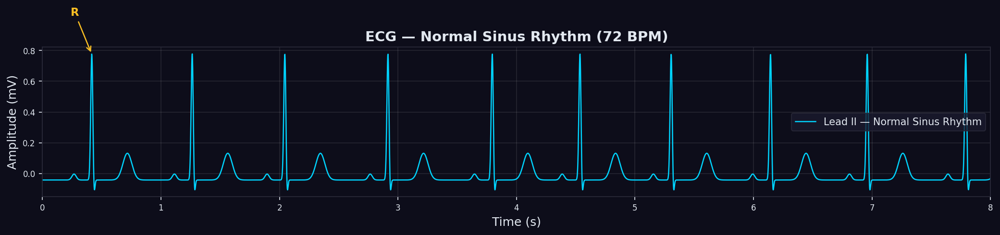

---

#### Example 2 — Arrhythmia comparison

```python
import matplotlib.pyplot as plt
from biosignal_simulator import ECGGenerator, ECGConfig

rhythms = ['normal', 'afib', 'pvc', 'bradycardia', 'tachycardia']
heart_rates = [72, 85, 72, 45, 130]

fig, axes = plt.subplots(5, 1, figsize=(14, 10), sharex=False)

for i, (rhythm, hr) in enumerate(zip(rhythms, heart_rates)):
    cfg = ECGConfig(fs=500, duration_s=6, heart_rate=hr, rhythm_type=rhythm, seed=42)
    gen = ECGGenerator(cfg)
    sig = gen.generate()
    axes[i].plot(gen.t, sig, lw=1.0)
    axes[i].set_ylabel(rhythm.upper(), fontsize=9)
    axes[i].set_xlim(0, 5.5)
    axes[i].grid(alpha=0.2)

axes[-1].set_xlabel('Time (s)')
fig.tight_layout()
plt.savefig('ecg_rhythms.png', dpi=150, bbox_inches='tight')
```

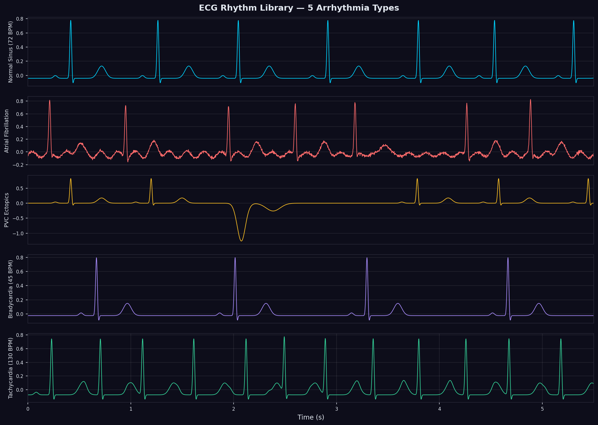

---

#### Example 3 — 12-Lead ECG

```python
from biosignal_simulator import ECGGenerator, ECGConfig
import matplotlib.pyplot as plt
import matplotlib.gridspec as gridspec

cfg = ECGConfig(
    fs=500, duration_s=10, heart_rate=72,
    lead_type='12lead',    # Returns (12, n_samples)
    seed=42
)

gen = ECGGenerator(cfg)
sig12 = gen.generate()    # shape: (12, 5000)
t = gen.t

print(f"12-lead shape: {sig12.shape}")   # (12, 5000)

lead_names = ['I', 'II', 'III', 'aVR', 'aVL', 'aVF', 'V1', 'V2', 'V3', 'V4', 'V5', 'V6']

fig = plt.figure(figsize=(16, 9))
gs = gridspec.GridSpec(3, 4, figure=fig, hspace=0.35, wspace=0.3)
for i, name in enumerate(lead_names):
    ax = fig.add_subplot(gs[i // 4, i % 4])
    ax.plot(t, sig12[i], lw=0.9)
    ax.set_title(name, fontsize=11, fontweight='bold')
    ax.set_xticks([]); ax.set_yticks([])

plt.savefig('12lead_ecg.png', dpi=150, bbox_inches='tight')
```

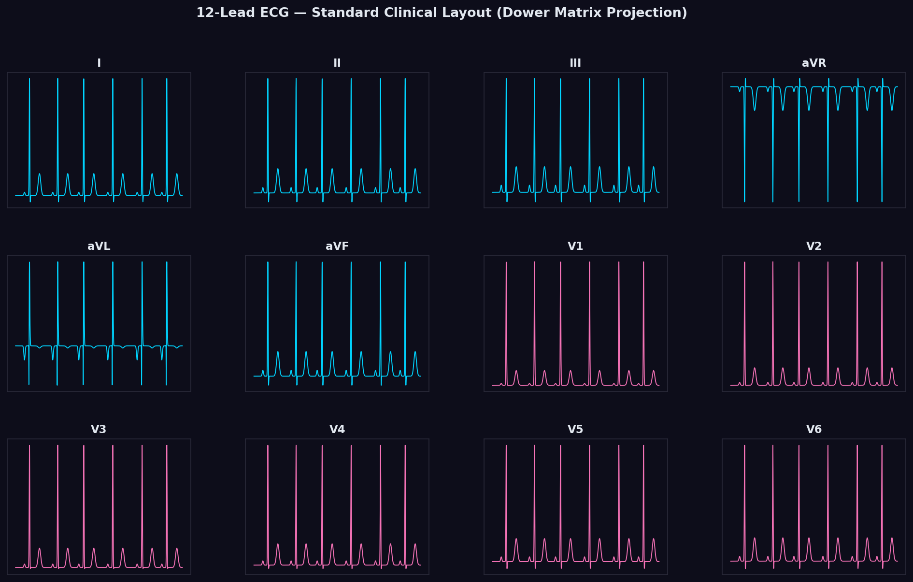

---

#### Example 4 — HRV analysis

```python
from biosignal_simulator import ECGGenerator, ECGConfig
from biosignal_simulator.signals.ecg import detect_r_peaks, compute_hrv_metrics

cfg = ECGConfig(fs=500, duration_s=60, heart_rate=72, hr_variability_std=0.08, seed=42)
gen = ECGGenerator(cfg)
sig = gen.generate()

# Detect R-peaks using Pan-Tompkins algorithm
r_peaks = detect_r_peaks(sig, fs=500)
print(f"Detected R-peaks: {len(r_peaks)}")   # ~72 peaks in 60s

# Compute HRV time-domain metrics
hrv = compute_hrv_metrics(r_peaks, fs=500)
print(f"Mean RR:   {hrv['mean_rr_ms']:.1f} ms")   # ~833 ms (72 BPM)
print(f"SDNN:      {hrv['sdnn_ms']:.1f} ms")       # ~65 ms (realistic)
print(f"RMSSD:     {hrv['rmssd_ms']:.1f} ms")      # ~42 ms
print(f"pNN50:     {hrv['pnn50']:.1f}%")            # ~28%
print(f"Mean HR:   {hrv['mean_hr_bpm']:.1f} BPM")  # ~72 BPM
print(f"Min RR:    {hrv['min_rr_ms']:.1f} ms")
print(f"Max RR:    {hrv['max_rr_ms']:.1f} ms")
```

**Output:**
```
Detected R-peaks: 73
Mean RR:   820.6 ms
SDNN:      62.4 ms
RMSSD:     39.7 ms
pNN50:     25.1%
Mean HR:   73.1 BPM
Min RR:    692.0 ms
Max RR:    978.0 ms
```

---

#### Example 5 — VCG and cardiac axis

```python
from biosignal_simulator import ECGGenerator, ECGConfig
from biosignal_simulator.signals.ecg import calculate_axis_from_vcg, vcg_loop_area

cfg = ECGConfig(fs=500, duration_s=5, lead_type='vcg', seed=42)
gen = ECGGenerator(cfg)
vcg = gen.generate()    # shape: (3, 2500) — [X, Y, Z]
t = gen.t

print(f"VCG shape: {vcg.shape}")  # (3, 2500)
print(f"X range: [{vcg[0].min():.3f}, {vcg[0].max():.3f}] mV")
print(f"Y range: [{vcg[1].min():.3f}, {vcg[1].max():.3f}] mV")
print(f"Z range: [{vcg[2].min():.3f}, {vcg[2].max():.3f}] mV")

# Compute cardiac electrical axis
axis = calculate_axis_from_vcg(vcg, t)
print(f"Frontal axis:     {axis['frontal_axis_deg']:.1f}°")     # Normal: 0–90°
print(f"Horizontal axis:  {axis['horizontal_axis_deg']:.1f}°")

# Compute QRS loop area in frontal plane
area = vcg_loop_area(vcg, plane='frontal')
print(f"QRS loop area:    {area:.4f} mV²")
```

---

#### QRS Morphology Extraction

```python
from biosignal_simulator.signals.ecg import compute_qrs_morphology, detect_r_peaks

cfg = ECGConfig(fs=500, duration_s=30, heart_rate=72, seed=42)
gen = ECGGenerator(cfg)
sig = gen.generate()

r_peaks = detect_r_peaks(sig, fs=500)
morpho = compute_qrs_morphology(sig, r_peaks, fs=500)

print(f"Mean R amplitude: {morpho['mean_r_amplitude_mv']:.3f} mV")
print(f"Std R amplitude:  {morpho['std_r_amplitude_mv']:.3f} mV")
print(f"Mean QRS width:   {morpho['mean_qrs_duration_ms']:.1f} ms")
```

---

### 5.2 EEGGenerator

```python
from biosignal_simulator import EEGGenerator, EEGConfig
```

#### Example 1 — Brain state generation

```python
from biosignal_simulator import EEGGenerator, EEGConfig

# Relaxed (eyes-closed) alpha-dominant EEG
cfg = EEGConfig(
    fs=256,
    duration_s=30,
    state='relaxed',
    amplitude_uv=55.0,
    alpha_peak_hz=9.8,         # Individual alpha frequency (IAF)
    band_powers={
        'delta': 0.15, 'theta': 0.25,
        'alpha': 1.00, 'beta': 0.35, 'gamma': 0.05
    },
    background_1f_power=0.25,
    seed=42
)

gen = EEGGenerator(cfg)
sig = gen.generate()           # shape: (7680,)
t = gen.t

print(f"Shape:      {sig.shape}")         # (7680,)
print(f"RMS:        {sig.std():.1f} μV")  # ~55 μV
print(f"Min/Max:    {sig.min():.1f} / {sig.max():.1f} μV")
```

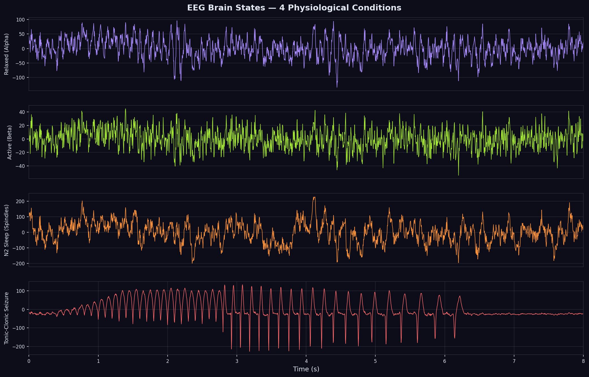

---

#### Example 2 — Seizure EEG

```python
cfg_seiz = EEGConfig(
    fs=256,
    duration_s=20,
    state='tonic_clonic',       # Generalized tonic-clonic seizure
    amplitude_uv=180.0,         # Large amplitude during seizure
    band_powers={
        'delta': 1.0, 'theta': 0.8, 'alpha': 0.3, 'beta': 0.5, 'gamma': 0.8
    },
    seed=42
)

gen_seiz = EEGGenerator(cfg_seiz)
sig_seiz = gen_seiz.generate()
print(f"Seizure RMS: {sig_seiz.std():.1f} μV")  # High amplitude
```

---

#### Example 3 — Multi-channel EEG with spatial correlation

```python
import numpy as np
from biosignal_simulator import EEGGenerator, EEGConfig

# Realistic EEG spatial correlation from Lempel & Segalowitz (2006) norms
corr_matrix = np.array([
    [1.00, 0.78, 0.62, 0.41, 0.33],  # Fz
    [0.78, 1.00, 0.73, 0.55, 0.44],  # Cz
    [0.62, 0.73, 1.00, 0.68, 0.58],  # Pz
    [0.41, 0.55, 0.68, 1.00, 0.75],  # O1
    [0.33, 0.44, 0.58, 0.75, 1.00],  # O2
])

cfg = EEGConfig(
    fs=256,
    duration_s=30,
    n_channels=5,
    corr_matrix=corr_matrix.tolist(),
    state='relaxed',
    amplitude_uv=60.0,
    seed=42
)

gen = EEGGenerator(cfg)
sig_mc = gen.generate()    # shape: (5, 7680)
t = gen.t

print(f"Multi-channel shape: {sig_mc.shape}")  # (5, 7680)

# Verify spatial correlation
from numpy import corrcoef
c = corrcoef(sig_mc)
print(f"Achieved Fz-Cz correlation:  {c[0,1]:.2f}")  # Close to 0.78
print(f"Achieved Fz-O2 correlation:  {c[0,4]:.2f}")  # Close to 0.33
```

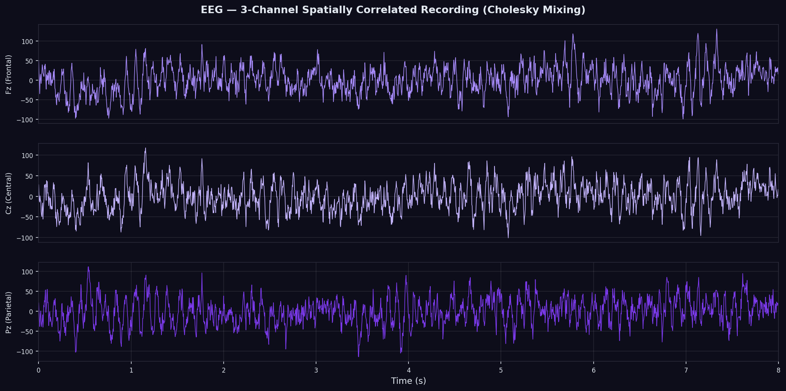

---

### 5.3 EMGGenerator

```python
from biosignal_simulator import EMGGenerator, EMGConfig
```

#### Example 1 — Normal surface EMG

```python
cfg = EMGConfig(
    fs=2000,
    duration_s=5,
    fmin_hz=20.0,
    fmax_hz=500.0,
    envelope_type='constant',
    contraction_level=1.0,      # 100% MVC (maximum voluntary contraction)
    amplitude_uv=500.0,
    emg_type='surface',
    pathology='normal',
    seed=42
)

gen = EMGGenerator(cfg)
sig = gen.generate()            # shape: (10000,)
t = gen.t

print(f"Shape:   {sig.shape}")             # (10000,)
print(f"RMS:     {np.sqrt(np.mean(sig**2)):.1f} μV")  # ~500 μV
print(f"Max:     {sig.max():.1f} μV")
```

---

#### Example 2 — Parkinson's tremor EMG

```python
cfg_pk = EMGConfig(
    fs=2000,
    duration_s=10,
    envelope_type='burst',
    burst_rate_hz=5.0,          # 4–6 Hz characteristic Parkinsonian tremor
    burst_duration_s=0.08,      # Short burst duration (typical MUAP cluster)
    pathology='parkinsons_tremor',
    amplitude_uv=300.0,
    seed=42
)

gen_pk = EMGGenerator(cfg_pk)
sig_pk = gen_pk.generate()
# Visible rhythmic bursting at ~5 Hz
```

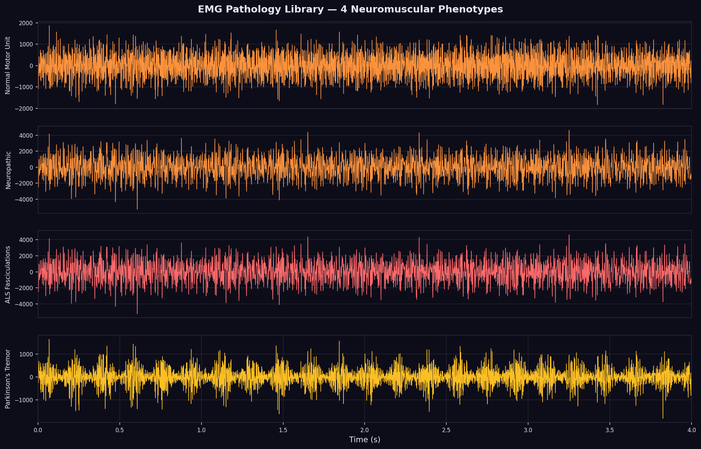

---

#### Example 3 — ALS fasciculation EMG

```python
cfg_als = EMGConfig(
    fs=2000,
    duration_s=5,
    pathology='als',            # Giant MUAPs, fasciculation potentials
    emg_type='intramuscular',  # Intramuscular needle recording
    amplitude_uv=800.0,
    seed=42
)
gen_als = EMGGenerator(cfg_als)
sig_als = gen_als.generate()
```

---

#### Example 4 — Burst contraction pattern

```python
cfg_burst = EMGConfig(
    fs=2000,
    duration_s=10,
    envelope_type='burst',
    burst_rate_hz=2.0,          # Burst every 0.5 seconds
    burst_duration_s=0.15,      # 150 ms active periods
    burst_amplitude=1.0,
    pathology='normal',
    seed=42
)

gen_burst = EMGGenerator(cfg_burst)
sig_burst = gen_burst.generate()
```

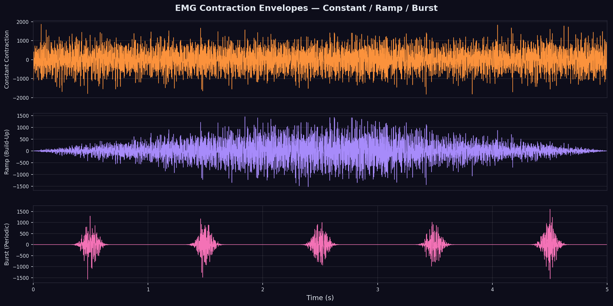

---

### 5.4 PPGGenerator

```python
from biosignal_simulator import PPGGenerator, PPGConfig
```

#### Example 1 — Basic PPG signal

```python
cfg = PPGConfig(
    fs=100,
    duration_s=15,
    heart_rate=72,
    systolic_fraction=0.25,    # 25% of cycle is systolic upstroke
    dicrotic_fraction=0.45,    # Dicrotic notch position
    resp_modulation=0.15,      # 15% amplitude modulation from breathing
    resp_rate=0.25,            # 0.25 Hz = 15 breaths/min
    seed=42
)

gen = PPGGenerator(cfg)
sig = gen.generate()           # shape: (1500,)
t = gen.t

print(f"Shape:   {sig.shape}")
print(f"Min/Max: {sig.min():.3f} / {sig.max():.3f} (normalized units)")
```

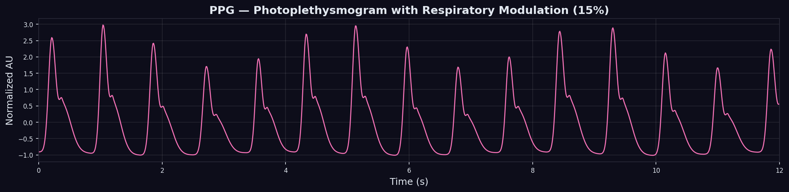

---

#### Example 2 — Tachycardic PPG

```python
cfg_tachy = PPGConfig(
    fs=100,
    duration_s=20,
    heart_rate=130,            # Tachycardic rate
    resp_modulation=0.25,
    dicrotic_fraction=0.30,    # Reduced dicrotic notch (increased SVR)
    seed=42
)

gen_tachy = PPGGenerator(cfg_tachy)
sig_tachy = gen_tachy.generate()
```

---

#### Example 3 — PPG Derivatives (VPG & APG)

The Velocity Plethysmogram (VPG) and Acceleration Plethysmogram (APG) are the first and second derivatives of the PPG signal, respectively. They are used clinically to assess vascular compliance and arterial stiffness.

```python
from biosignal_simulator import make_vpg, make_apg

# Generate VPG (first derivative)
vpg = make_vpg(duration_s=10.0, heart_rate=72.0, fs=100.0)

# Generate APG (second derivative)
apg = make_apg(duration_s=10.0, heart_rate=72.0, fs=100.0)
```

Alternatively, configure these directly in `PPGConfig` using the `derivative` parameter:

```python
cfg = PPGConfig(fs=100.0, duration_s=10.0, derivative='vpg')
vpg = PPGGenerator(cfg).generate()
```

---

#### Example 4 — Ambient Noise Contamination (Light & Motion)

Wearable PPG sensors suffer from motion artifacts (due to sensor movement on the skin) and ambient light leakage (due to changes in the skin-sensor seal).

```python
from biosignal_simulator import make_ppg_motion_artifact, make_ppg_light_leakage

# Generate PPG with motion artifact (LF drifts + sudden transient impact spikes)
motion_ppg = make_ppg_motion_artifact(duration_s=15.0, snr_db=12.0)

# Generate PPG with indoor AC light leakage flicker (100/120 Hz flicker modulated by breathing)
light_ppg = make_ppg_light_leakage(duration_s=15.0, snr_db=12.0)
```

---

### 5.5 EDAGenerator

```python
from biosignal_simulator import EDAGenerator, EDAConfig
```

#### Example 1 — Resting EDA

```python
cfg = EDAConfig(
    fs=32,
    duration_s=120,
    scl_amplitude_us=8.0,      # Resting tonic conductance 8 μS
    scl_drift_rate=0.005,      # Slow tonic drift
    event_rate_hz=0.1,         # One SCR every ~10 seconds
    scr_rise_s=1.5,            # 1.5s rise time (typical)
    scr_decay_s=5.0,           # 5s decay constant
    seed=42
)

gen = EDAGenerator(cfg)
sig = gen.generate()           # shape: (3840,)
t = gen.t

print(f"Mean SCL:   {sig.mean():.2f} μS")   # ~8 μS
print(f"Max SCR:    {sig.max():.2f} μS")     # Peak amplitude
print(f"Std:        {sig.std():.2f} μS")
```

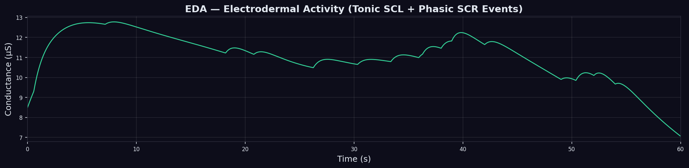

---

#### Example 2 — Stress state EDA

```python
cfg_stress = EDAConfig(
    fs=32,
    duration_s=60,
    scl_amplitude_us=20.0,     # Elevated tonic level during stress
    event_rate_hz=0.5,         # More frequent SCRs (one every 2s)
    scr_rise_s=0.8,            # Faster rise during sympathetic activation
    scr_decay_s=3.5,
    seed=42
)
gen_stress = EDAGenerator(cfg_stress)
sig_stress = gen_stress.generate()
print(f"Stress SCL: {sig_stress.mean():.2f} μS")  # ~20 μS
```

---

### 5.6 RespGenerator

```python
from biosignal_simulator import RespGenerator, RespConfig
```

#### Example 1 — Normal breathing

```python
cfg = RespConfig(
    fs=32,
    duration_s=120,
    resp_rate_hz=0.25,         # 15 breaths/min (normal)
    amplitude=1.0,
    harmonic_k=0.3,            # Expiration 30% longer than inspiration
    phase_noise_std=0.08,      # Slight cycle-to-cycle variability
    seed=42
)

gen = RespGenerator(cfg)
sig = gen.generate()           # shape: (3840,)
t = gen.t

print(f"Shape:   {sig.shape}")
print(f"Mean:    {sig.mean():.3f}")  # Near zero (centered)
print(f"Std:     {sig.std():.3f}")   # ~amplitude/2
```

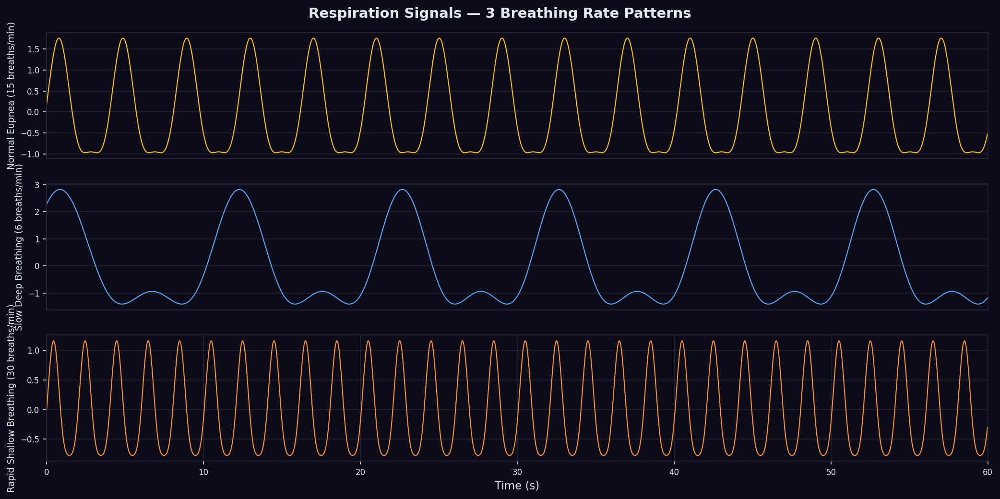

---

#### Example 2 — Slow deep breathing (relaxation technique)

```python
cfg_deep = RespConfig(
    fs=32,
    duration_s=120,
    resp_rate_hz=0.1,          # 6 breaths/min (diaphragmatic breathing)
    amplitude=1.5,             # Larger tidal volume
    harmonic_k=0.4,
    phase_noise_std=0.05,
    seed=42
)
gen_deep = RespGenerator(cfg_deep)
sig_deep = gen_deep.generate()
```

---

#### BaseSignal Common Methods

These methods are available on **all** signal generators:

**`resample(new_fs)`** — Resample to new sampling frequency:

```python
from biosignal_simulator import ECGGenerator, ECGConfig

gen = ECGGenerator(ECGConfig(fs=500, duration_s=10, seed=42))
sig_500 = gen.generate()           # 5000 samples

sig_250 = gen.resample(250.0)      # 2500 samples at 250 Hz
print(f"Original: {sig_500.shape}") # (5000,)
print(f"Resampled: {sig_250.shape}") # (2500,)
```

**`remove_baseline(method)`** — Remove baseline drift:

```python
from biosignal_simulator import ECGGenerator, ECGConfig

gen = ECGGenerator(ECGConfig(fs=500, duration_s=10, seed=42))

# Available methods: 'mean', 'linear', 'cubic_spline', 'iir_highpass',
#                    'savitzky_golay', 'double_median'
corrected_spline = gen.remove_baseline('cubic_spline')
corrected_median = gen.remove_baseline('double_median')  # Best for ECG
corrected_hp = gen.remove_baseline('iir_highpass')
```

**`to_record()`** — Package into SignalRecord:

```python
rec = gen.to_record(notes="Resting ECG - patient ID 001")
print(rec.summary())
```

---

## 6. Noise Models

All noise models inherit from `BaseNoiseModel`:

```python
class BaseNoiseModel(ABC):
    def generate(self, n_samples: int, fs: float) -> np.ndarray
    def generate_scaled(self, clean_signal: np.ndarray, target_snr_db: float) -> np.ndarray
```

The `generate_scaled(clean_signal, target_snr_db)` method is particularly useful for adding noise at a precise SNR without using `SignalMixer`.

---

### 6.1 GaussianNoise

White Gaussian noise (AWGN) — the most fundamental and universal noise model in signal processing. Represents thermal noise in electronic amplifier circuits.

**Mathematical model:** `n[t] ~ N(mean, std²)`

```python
from biosignal_simulator import GaussianNoise
from biosignal_simulator.core.config import GaussianNoiseConfig

model = GaussianNoise(GaussianNoiseConfig(std=0.05, mean=0.0, seed=42))
noise = model.generate(n_samples=1000, fs=500)

print(f"Shape:   {noise.shape}")   # (1000,)
print(f"Mean:    {noise.mean():.4f}")  # ~0.0
print(f"Std:     {noise.std():.4f}")   # ~0.05
```

**Scaled to target SNR:**

```python
from biosignal_simulator import ECGGenerator, ECGConfig, GaussianNoise
from biosignal_simulator.core.config import GaussianNoiseConfig

gen = ECGGenerator(ECGConfig(fs=500, duration_s=10, seed=42))
clean_sig = gen.generate()

model = GaussianNoise(GaussianNoiseConfig(seed=1))

# Add noise at exactly 20 dB SNR
noise_20db = model.generate_scaled(clean_sig, target_snr_db=20.0)
noisy_20db = clean_sig + noise_20db

# Verify achieved SNR
p_sig = np.mean(clean_sig**2)
p_noise = np.mean(noise_20db**2)
achieved_snr = 10 * np.log10(p_sig / p_noise)
print(f"Target SNR:   20.0 dB")
print(f"Achieved SNR: {achieved_snr:.2f} dB")  # 20.00 dB
```

---

### 6.2 ColoredNoise / PinkNoise / BrownNoise / BlueNoise / VioletNoise

Colored noise with power spectral density following `S(f) ∝ 1/f^α`.

```python
from biosignal_simulator import ColoredNoise, PinkNoise, BrownNoise, BlueNoise, VioletNoise
from biosignal_simulator.core.config import ColoredNoiseConfig

# Generic colored noise (α = 1.5, between pink and brown)
model_colored = ColoredNoise(ColoredNoiseConfig(exponent=1.5, std=1.0, method='fft', seed=42))

# Convenience constructors for common colors:
pink = PinkNoise(std=1.0, method='fft', seed=42)    # α = 1.0 (1/f)
brown = BrownNoise(std=1.0, seed=42)                 # α = 2.0 (1/f²)
blue = BlueNoise(std=1.0, seed=42)                   # α = -1.0 (f)
violet = VioletNoise(std=1.0, seed=42)               # α = -2.0 (f²)

for model, name in [(pink, 'Pink'), (brown, 'Brown'), (blue, 'Blue'), (violet, 'Violet')]:
    n = model.generate(n_samples=10000, fs=500)
    print(f"{name}: mean={n.mean():.4f}, std={n.std():.4f}")
```

**Three generation algorithms:**

| Method | `method=` | Speed | Accuracy | Streaming |
|--------|-----------|-------|---------|----------|
| FFT spectral shaping | `'fft'` | Fast (batch) | ✅ Exact | No |
| Voss-McCartney cascade | `'voss'` | Medium | Good (α≈1) | Yes |
| IIR filter | `'iir'` | Very fast | Good (α=1,2) | Yes |

**Choosing the generation method:**

```python
# Best accuracy for arbitrary alpha
pink_fft = PinkNoise(std=1.0, method='fft', seed=42)

# Real-time friendly
pink_iir = PinkNoise(std=1.0, method='iir', seed=42)
pink_voss = PinkNoise(std=1.0, method='voss', seed=42)
```

---

### 6.3 BaselineWander

Simulates baseline drift caused by electrode impedance changes from respiratory chest wall movement, body position shifts, and sweating.

**Components:**
1. **Respiratory component**: Sinusoidal at `f_resp_hz` (0.25 Hz ≈ 15 breaths/min).
2. **Random-walk drift**: Slow Brownian motion from electrode gel absorption.
3. **Polynomial trend**: Linear or quadratic long-term drift from posture changes.

```python
from biosignal_simulator import BaselineWander
from biosignal_simulator.core.config import BaselineWanderConfig

cfg = BaselineWanderConfig(
    amplitude=0.2,             # Total wander amplitude (mV for ECG)
    f_resp_hz=0.25,            # 15 breaths/min respiration
    resp_fraction=0.6,         # 60% is respiratory
    drift_fraction=0.3,        # 30% is random walk drift
    trend_fraction=0.1,        # 10% is polynomial trend
    trend_degree=1,            # Linear trend
    seed=42
)

model = BaselineWander(cfg)
wander = model.generate(n_samples=5000, fs=500)  # shape: (5000,)

print(f"Amplitude range: {wander.ptp():.3f} mV")  # ~0.2 mV
print(f"Main frequency:  {0.25:.2f} Hz")
```

**Combining with ECG:**

```python
from biosignal_simulator import ECGGenerator, ECGConfig, BaselineWander
from biosignal_simulator.core.config import ECGConfig, BaselineWanderConfig

gen = ECGGenerator(ECGConfig(fs=500, duration_s=10, seed=42))
clean = gen.generate()

bw = BaselineWander(BaselineWanderConfig(amplitude=0.15, f_resp_hz=0.25, seed=1))
wander = bw.generate(len(clean), 500)

noisy = clean + wander
```

---

### 6.4 PowerlineNoise

50 Hz or 60 Hz AC mains interference with harmonics (100/120 Hz, 150/180 Hz, …). Models the coupling of electrical grid interference into biomedical recording amplifiers through common-mode rejection failure.

```python
from biosignal_simulator import PowerlineNoise
from biosignal_simulator.core.config import PowerlineNoiseConfig

# European 50 Hz grid with 3 harmonics
cfg = PowerlineNoiseConfig(
    f_line_hz=50.0,            # 50 Hz (Europe/Asia) or 60.0 Hz (Americas)
    n_harmonics=3,             # 50, 100, 150 Hz components
    amplitude=0.05,            # 0.5 mm peak interference
    harmonic_decay=1.0,        # Equal amplitude harmonics (1.0 = same)
    freq_std_hz=0.1,           # Frequency instability (grid frequency drift)
    amplitude_mod_depth=0.1,   # 10% amplitude modulation (load variation)
    phase_drift_std=0.02,
    seed=42
)

model = PowerlineNoise(cfg)
noise = model.generate(n_samples=5000, fs=500)

# Verify 50 Hz component using FFT
fft = np.fft.rfft(noise)
freqs = np.fft.rfftfreq(len(noise), d=1/500)
peak_idx = np.argmax(np.abs(fft))
print(f"Dominant frequency: {freqs[peak_idx]:.1f} Hz")  # 50.0 Hz
```

---

### 6.5 MotionArtifact

Multi-component motion artifact model combining:
1. **Low-frequency movement artifacts** (0.1–10 Hz): Body sway, walking, respiration.
2. **Impact transients**: Sharp mechanical shocks from activity.
3. **Cable friction artifacts**: Intermittent contact noise from electrode lead movement.

```python
from biosignal_simulator import MotionArtifact
from biosignal_simulator.core.config import MotionArtifactConfig

cfg = MotionArtifactConfig(
    lf_amplitude=0.3,          # Low-frequency motion amplitude
    lf_fmin_hz=0.1,
    lf_fmax_hz=8.0,
    impact_rate_hz=0.3,        # One impact every ~3 seconds
    impact_amplitude=1.5,      # Large transient spike amplitude
    impact_decay_s=0.3,        # 300 ms decay
    cable_amplitude=0.05,
    enable_lf=True,
    enable_impacts=True,        # Also add impacts
    enable_cable=True,
    seed=42
)

model = MotionArtifact(cfg)
noise = model.generate(n_samples=5000, fs=500)
```

---

### 6.6 ElectrodeNoise

Two-component model of electrode interface noise:
1. **Popcorn (burst) noise**: Random telegraph signal caused by lattice defects in metal-electrolyte interface. Manifests as sudden, random discrete jumps in amplitude.
2. **Johnson thermal (impedance) noise**: Fundamental thermal noise limited by electrode impedance. `V_n = sqrt(4 k_B T R BW)`.

```python
from biosignal_simulator import ElectrodeNoise
from biosignal_simulator.core.config import ElectrodeNoiseConfig

# High-impedance electrode (poor contact, dry electrode)
cfg_hi = ElectrodeNoiseConfig(
    enable_popcorn=True,
    popcorn_amplitude=0.08,
    popcorn_rate_hz=10.0,      # Frequent bursts (poor contact)
    enable_impedance_noise=True,
    impedance_ohms=50000.0,    # High impedance (50 kΩ dry electrode)
    temperature_k=310.0,
    seed=42
)

model_hi = ElectrodeNoise(cfg_hi)
noise_hi = model_hi.generate(n_samples=5000, fs=500)
print(f"High-Z noise std: {noise_hi.std():.4f} mV")

# Low-impedance electrode (gel, good contact)
cfg_lo = ElectrodeNoiseConfig(
    enable_popcorn=False,
    enable_impedance_noise=True,
    impedance_ohms=2000.0,     # 2 kΩ gel electrode
    temperature_k=310.0,
    seed=42
)
model_lo = ElectrodeNoise(cfg_lo)
noise_lo = model_lo.generate(n_samples=5000, fs=500)
print(f"Low-Z noise std:  {noise_lo.std():.4f} mV")
```

---

### 6.7 EMGArtifact

Simulates electromyographic contamination of EEG or ECG signals from nearby muscle groups. Produces bandpass-filtered burst activity that looks like noise from a different tissue of origin.

```python
from biosignal_simulator import EMGArtifact
from biosignal_simulator.core.config import EMGArtifactConfig

cfg = EMGArtifactConfig(
    fmin_hz=20.0,              # EMG bandwidth start
    fmax_hz=500.0,             # EMG bandwidth end
    burst_rate_hz=2.0,         # Muscle contraction bursts at 2 Hz
    burst_duration_s=0.3,      # 300 ms burst duration
    amplitude_fraction=0.15,   # 15% contamination level
    seed=42
)

model = EMGArtifact(cfg)
noise = model.generate(n_samples=5000, fs=500)
```

---

### 6.8 ImpulseNoise

Isolated transient spike noise following a Gamma-distributed amplitude pattern. Represents electrostatic discharge, power supply glitches, or artifact spikes from electrode movement.

```python
from biosignal_simulator import ImpulseNoise
from biosignal_simulator.core.config import ImpulseNoiseConfig

cfg = ImpulseNoiseConfig(
    rate_hz=2.0,               # 2 spikes per second average (Poisson)
    amplitude_scale=3.0,       # Scale factor for spike amplitudes
    amplitude_shape=0.5,       # Gamma distribution shape (0.5 = heavy tail)
    pulse_width_s=0.001,       # 1 ms wide pulses (0 = delta impulse)
    polarity='bipolar',        # Random polarity (both + and -)
    seed=42
)

model = ImpulseNoise(cfg)
noise = model.generate(n_samples=5000, fs=500)

# Count detected spikes
spikes = np.where(np.abs(noise) > noise.std() * 3)[0]
print(f"Detected spikes: {len(spikes)}")  # ~10 over 10 seconds
```

---

### 6.9 QuantizationNoise

Simulates the discretization error from analog-to-digital conversion. Key parameters are the bit resolution and voltage range.

```python
from biosignal_simulator import QuantizationNoise
from biosignal_simulator.core.config import QuantizationNoiseConfig

# Medical-grade 16-bit ADC
cfg_16 = QuantizationNoiseConfig(n_bits=16, v_range=5.0, dither=False)
qn_16 = QuantizationNoise(cfg_16)

# Consumer-grade 8-bit ADC
cfg_8 = QuantizationNoiseConfig(n_bits=8, v_range=5.0, dither=True)
qn_8 = QuantizationNoise(cfg_8)

# Generate and apply
from biosignal_simulator import ECGGenerator, ECGConfig
gen = ECGGenerator(ECGConfig(fs=500, duration_s=3, seed=42))
clean = gen.generate()

quantized_16, q_error_16 = qn_16.apply(clean.copy())
quantized_8, q_error_8 = qn_8.apply(clean.copy())

# Theoretical SQNR: 6.02*n + 1.76 dB
print(f"16-bit theory SQNR: {6.02*16 + 1.76:.1f} dB")   # 98.1 dB
print(f"8-bit theory SQNR:  {6.02*8 + 1.76:.1f} dB")    # 49.9 dB

# Measured SQNR
snr_16 = 10*np.log10(np.mean(clean**2) / np.mean(q_error_16**2))
snr_8 = 10*np.log10(np.mean(clean**2) / np.mean(q_error_8**2))
print(f"16-bit measured:    {snr_16:.1f} dB")
print(f"8-bit measured:     {snr_8:.1f} dB")
```

**Output:**
```
16-bit theory SQNR: 98.1 dB
8-bit theory SQNR:  49.9 dB
16-bit measured:    97.3 dB
8-bit measured:     48.2 dB
```

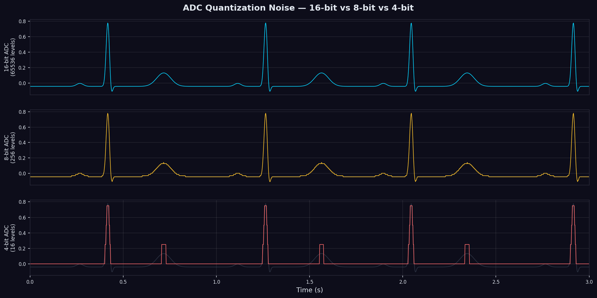

---

### 6.10 CrosstalkNoise

Simulates physiological signal leakage from one modality into another (e.g., cardiac waveforms appearing in EEG due to pulse artifact, or breathing modulation in ECG).

```python
from biosignal_simulator import CrosstalkNoise
from biosignal_simulator.core.config import CrosstalkNoiseConfig

cfg = CrosstalkNoiseConfig(
    coupling_factor=0.08,      # 8% amplitude bleeding
    source_type='ecg',         # Source modality leaking in
    seed=42
)

model = CrosstalkNoise(cfg)
crosstalk = model.generate(n_samples=5000, fs=500)
# Returns a synthetic ECG-like signal scaled by coupling_factor
```

---

## 7. Wearable Artifact Models

Wearable artifact models are **non-linear** transforms applied to an existing signal — they do not simply add noise. They are applied via `.apply(signal, fs)` rather than `.generate()`.

---

### 7.1 SensorDetachmentNoise

Simulates sudden electrode detachment events. After the detachment time:
1. A brief high-voltage **transient spike** models the discharge of stored charge at the electrode interface.
2. The signal **flatlines** to a low-amplitude amplifier noise baseline (no signal information).

```python
from biosignal_simulator.noise.wearable import SensorDetachmentNoise
from biosignal_simulator.core.config import SensorDetachmentConfig
from biosignal_simulator import ECGGenerator, ECGConfig

gen = ECGGenerator(ECGConfig(fs=500, duration_s=10, seed=42))
clean_ecg = gen.generate()

cfg = SensorDetachmentConfig(
    detachment_time_s=4.0,     # Lead falls off at t=4s
    transient_duration_s=0.2,  # 200 ms transient spike
    transient_amplitude=5.0,   # ±5 mV spike amplitude
    noise_level_uv=15.0,       # Amplifier baseline noise (15 μV)
    seed=42
)

model = SensorDetachmentNoise(cfg)
noisy_ecg, det_error = model.apply(clean_ecg.copy(), fs=500)
# noisy_ecg: clean until t=4s, then spike + flatline
# det_error: the difference signal (subtraction residual)
```

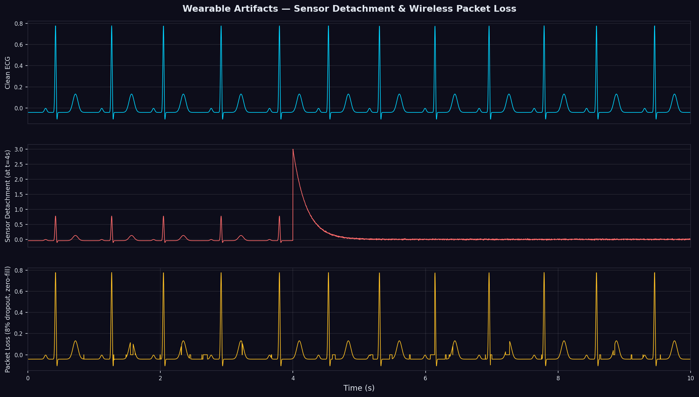

---

### 7.2 ElectrodeDisplacementNoise

Simulates electrode movement events that produce sudden DC offset jumps and increased noise at the affected time points.

```python
from biosignal_simulator.noise.wearable import ElectrodeDisplacementNoise
from biosignal_simulator.core.config import ElectrodeDisplacementConfig

cfg = ElectrodeDisplacementConfig(
    displacement_times=[2.0, 5.5, 8.0],      # Three displacement events
    shift_amplitudes=[0.3, -0.5, 0.2],        # DC offset shifts (mV)
    noise_increments=[3.0, 2.5, 1.5],         # Noise multiplier after event
    seed=42
)

model = ElectrodeDisplacementNoise(cfg)
noisy_ecg, disp_error = model.apply(clean_ecg.copy(), fs=500)
```

---

### 7.3 LightLeakageNoise

Simulates ambient light interference into PPG optical sensors. Three components:
1. **Steady leakage**: DC background light contamination.
2. **Modulated leakage**: Amplitude modulated by respiration/motion at `modulation_frequency_hz`.
3. **Harmonic fluorescent flicker**: Indoor 50/60 Hz and harmonics from fluorescent lights.

```python
from biosignal_simulator.noise.wearable import LightLeakageNoise
from biosignal_simulator.core.config import LightLeakageConfig

cfg = LightLeakageConfig(
    leakage_amplitude=0.25,        # 25% of signal amplitude
    modulation_frequency_hz=0.25,  # Modulated at breathing rate
    f_line_hz=50.0,                # Fluorescent light flicker
    harmonic_leakage=0.08,         # 8% harmonic leakage
    seed=42
)

model = LightLeakageNoise(cfg)
noisy_ppg, light_error = model.apply(ppg_signal.copy(), fs=100)
```

---

### 7.4 PacketLossNoise

Simulates wireless telemetry data dropouts using a Bernoulli burst process. Missing sample windows are filled using one of three strategies.

```python
from biosignal_simulator.noise.wearable import PacketLossNoise
from biosignal_simulator.core.config import PacketLossConfig

# Zero-fill (most common industrial standard — easy to detect)
cfg_zero = PacketLossConfig(
    loss_rate=0.05,              # 5% packet loss probability
    burst_length_samples=10,     # Bursts of ~10 samples (20 ms at 500 Hz)
    interpolation_mode='zero',   # Fill with zeros
    seed=42
)

# Hold-last (zero-order hold — conservative)
cfg_hold = PacketLossConfig(
    loss_rate=0.03,
    burst_length_samples=8,
    interpolation_mode='hold',   # Repeat last valid sample
    seed=42
)

# Linear interpolation (smoothest but may create false features)
cfg_linear = PacketLossConfig(
    loss_rate=0.04,
    burst_length_samples=15,
    interpolation_mode='linear',
    seed=42
)

model_zero = PacketLossNoise(cfg_zero)
noisy_ecg, loss_error = model_zero.apply(clean_ecg.copy())
```

---

## 8. Composer Pipeline

The composer pipeline orchestrates multi-source composite signal generation with precise noise control.

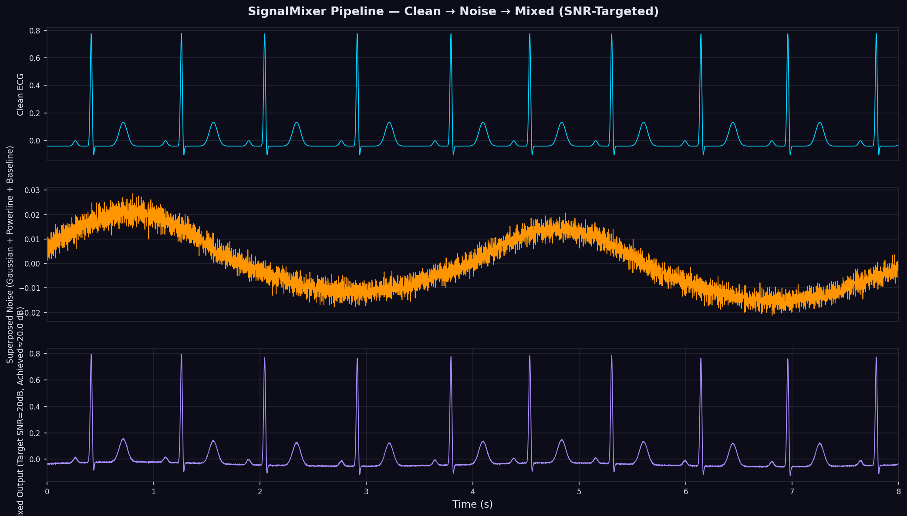

---

### 8.1 SignalMixer

`SignalMixer` is the central orchestrator of the simulation pipeline. It:
1. Generates the primary clean signal.
2. Optionally mixes in additional composite signals (ECG + Respiration, etc.).
3. Generates and sums all additive noise components.
4. Applies SNR scaling (static or dynamic).
5. Applies non-linear wearable artifacts in the correct physical cascade order:
   - Sensor Detachment
   - Packet Loss
   - ADC Quantization
6. Returns a complete `SignalRecord` with all metadata.

**Mathematical Pipeline:**

```
x_composite = Σⱼ βⱼ · sⱼ(t)          ← Clean signal superposition
n_additive = Σₖ wₖ(t)                 ← Additive noise sum
x_noisy = Q(D(P(x_composite + n_SNR))) ← Non-linear cascade
```

where P = Sensor Detachment suppression, D = Packet Loss dropout, Q = ADC Quantization.

```python
from biosignal_simulator import (ECGGenerator, ECGConfig, GaussianNoise,
                                   BaselineWander, PowerlineNoise, SignalMixer)
from biosignal_simulator.core.config import (GaussianNoiseConfig, BaselineWanderConfig,
                                              PowerlineNoiseConfig)

# Primary signal
gen = ECGGenerator(ECGConfig(fs=500, duration_s=10, heart_rate=72, seed=42))

# Noise models
noises = [
    GaussianNoise(GaussianNoiseConfig(std=0.02, seed=0)),
    BaselineWander(BaselineWanderConfig(amplitude=0.15, f_resp_hz=0.25, seed=1)),
    PowerlineNoise(PowerlineNoiseConfig(f_line_hz=50.0, amplitude=0.03, seed=2)),
]

# Create mixer with 20 dB target SNR
mixer = SignalMixer(
    signal_generator=gen,
    noise_models=noises,
    target_snr_db=20.0,            # Static SNR target
    metadata={"patient_id": "P001", "study": "baseline"}
)

rec = mixer.mix()                  # Returns SignalRecord

print(f"Target SNR:   20.0 dB")
print(f"Achieved SNR: {rec.snr_db:.2f} dB")          # Very close to 20.0
print(f"Clean shape:  {rec.clean.shape}")              # (5000,)
print(f"Noisy shape:  {rec.noisy.shape}")              # (5000,)
print(f"Noise comps:  {list(rec.noise_components.keys())}")
# ['GaussianNoise', 'BaselineWander', 'PowerlineNoise']
```

**Composite multi-signal mixing:**

```python
from biosignal_simulator import (ECGGenerator, RespGenerator, ECGConfig, RespConfig, SignalMixer)
from biosignal_simulator.core.config import GaussianNoiseConfig

# Primary: ECG
ecg_gen = ECGGenerator(ECGConfig(fs=500, duration_s=10, heart_rate=72, seed=42))

# Secondary: Respiration (chest wall movement modulating ECG)
resp_gen = RespGenerator(RespConfig(fs=500, duration_s=10, resp_rate_hz=0.25, seed=43))

# Compose ECG + 20% respiration artifact
mixer = SignalMixer(
    signal_generator=ecg_gen,
    noise_models=[GaussianNoise(GaussianNoiseConfig(seed=0))],
    target_snr_db=25.0,
    composite_signals=[(resp_gen, 0.20)],   # 20% coupling factor
)

rec = mixer.mix()
# rec.clean now contains ECG + 20% respiration
```

---

### 8.2 NoiseScheduler

`NoiseScheduler` enables time-varying noise envelopes — noise that changes in amplitude over the course of the recording.

```python
from biosignal_simulator.composer.scheduler import (
    NoiseScheduler, LinearSchedule, StepSchedule, SinusoidalSchedule,
    GaussianBurstSchedule
)
from biosignal_simulator import GaussianNoise
from biosignal_simulator.core.config import GaussianNoiseConfig

# Example 1: Linearly increasing noise over time
model = GaussianNoise(GaussianNoiseConfig(seed=0))
linear_schedule = LinearSchedule(
    start_amplitude=0.01,  # Low noise at start
    end_amplitude=0.15     # High noise at end
)

scheduler = NoiseScheduler(model, linear_schedule)
noise_linear = scheduler.apply(n_samples=5000, fs=500)
# Returns modulated noise with linearly increasing amplitude

# Example 2: Step schedule (noise turns on at t=3s)
step_schedule = StepSchedule(
    step_times=[3.0],              # Turn on noise at 3 seconds
    amplitudes=[0.0, 0.10],        # Before: 0, After: 0.10
)
scheduler_step = NoiseScheduler(model, step_schedule)
noise_step = scheduler_step.apply(n_samples=5000, fs=500)

# Example 3: Sinusoidal noise modulation (fluctuating SNR)
sin_schedule = SinusoidalSchedule(
    mean_amplitude=0.05,           # Mean noise level
    variation=0.04,                # ±4% variation
    frequency_hz=0.5               # 0.5 Hz oscillation
)
scheduler_sin = NoiseScheduler(model, sin_schedule)
noise_sin = scheduler_sin.apply(n_samples=5000, fs=500)
```

**Using with SignalMixer:**

```python
from biosignal_simulator.composer.scheduler import LinearSchedule

linear_schedule = LinearSchedule(start_amplitude=0.01, end_amplitude=0.2)

mixer = SignalMixer(
    signal_generator=gen,
    noise_models=[GaussianNoise(GaussianNoiseConfig(seed=0))],
    target_snr_db=linear_schedule,   # Pass Schedule as SNR target
)
```

---

### 8.3 ArtifactInjector

`ArtifactInjector` enables precise event-based insertion of transient artifacts at specified times.

```python
from biosignal_simulator.composer.artifact_injector import ArtifactInjector

gen = ECGGenerator(ECGConfig(fs=500, duration_s=10, seed=42))
clean = gen.generate()

injector = ArtifactInjector(fs=500)

# Inject a single electromagnetic spike at t=3.5s
clean_with_spike = injector.inject_spike(
    signal=clean.copy(),
    time_s=3.5,
    amplitude=2.0,
    width_s=0.002
)

# Inject a transient motion artifact at t=6.0s
clean_with_motion = injector.inject_motion_burst(
    signal=clean.copy(),
    time_s=6.0,
    duration_s=0.5,
    amplitude=0.4,
    frequency_hz=3.0
)

# Inject clipping saturation at t=7.5s
clean_with_clip = injector.inject_clipping(
    signal=clean.copy(),
    start_time_s=7.5,
    duration_s=0.8,
    clamp_value=1.5
)
```

---

### 8.4 SNRController

The `SNRController` scales noise to achieve a specific target SNR. The `DynamicSNRController` extends this for time-varying SNR profiles.

```python
from biosignal_simulator.composer.snr_controller import SNRController, DynamicSNRController
from biosignal_simulator import ECGGenerator, ECGConfig, GaussianNoise
from biosignal_simulator.core.config import GaussianNoiseConfig

gen = ECGGenerator(ECGConfig(fs=500, duration_s=10, seed=42))
clean = gen.generate()

noise_model = GaussianNoise(GaussianNoiseConfig(seed=0))

# Static SNR control
controller = SNRController(noise_model, target_snr_db=15.0)
scaled_noise = controller.apply(clean, fs=500)

# Verify
p_sig = np.mean(clean**2)
p_noise = np.mean(scaled_noise**2)
actual_snr = 10*np.log10(p_sig / p_noise)
print(f"Target: 15.0 dB, Achieved: {actual_snr:.2f} dB")
```

---

## 9. SignalRecord

`SignalRecord` is the universal output container for all simulation results. It is returned by `SignalMixer.mix()`, `generator.to_record()`, and loaded from any I/O export.

```python
from biosignal_simulator.core.record import SignalRecord
```

### Attributes

| Attribute | Type | Description |
|-----------|------|-------------|
| `signal_type` | `str` | Signal modality ('ecg', 'eeg', etc.) |
| `fs` | `float` | Sampling frequency in Hz |
| `t` | `np.ndarray` | Time vector of shape `(n_samples,)` |
| `clean` | `np.ndarray` | Clean reference signal |
| `noisy` | `np.ndarray` | Noisy output signal |
| `noise_components` | `Dict[str, np.ndarray]` | Individual noise realizations by model name |
| `signal_params` | `Dict[str, Any]` | Signal generator configuration |
| `noise_params` | `Dict[str, Any]` | Noise model configurations |
| `snr_db` | `Optional[float]` | Achieved post-hoc SNR |
| `metadata` | `Dict[str, Any]` | Custom annotations |
| `quality_flags` | `Dict[str, bool]` | Automated quality checks |
| `quality_metrics` | `Dict[str, float]` | Statistical descriptors |

### Properties

| Property | Returns | Description |
|----------|---------|-------------|
| `.duration_s` | `float` | Signal length in seconds |
| `.n_channels` | `int` | Number of channels |
| `.n_samples` | `int` | Samples per channel |
| `.is_valid` | `bool` | All quality checks pass |
| `.has_artifacts` | `bool` | Any artifact quality flags active |
| `.dynamic_range` | `float` | max(noisy) - min(noisy) |
| `.peak_to_peak` | `float` | Same as `dynamic_range` |
| `.snr_linear` | `float` | SNR in linear power ratio |

### Quality Flags (auto-computed)

| Flag | Fail Condition |
|------|---------------|
| `has_nan` | Signal contains NaN values |
| `has_inf` | Signal contains Infinite values |
| `is_clipped` | >0.1% samples at amplitude extremes |
| `has_dc_offset` | Mean > 15% of standard deviation |
| `too_noisy` | Achieved SNR < -5.0 dB |
| `is_flatline` | Standard deviation < 1e-6 |
| `has_high_kurtosis` | Excess kurtosis > 8.0 |

### Quality Metrics (auto-computed)

| Metric | Key | Description |
|--------|-----|-------------|
| RMS (clean) | `clean_rms` | Root mean square of clean signal |
| Skewness | `clean_skewness` | Asymmetry of amplitude distribution |
| Kurtosis | `clean_kurtosis` | Tail heaviness (excess) |
| Zero-Crossing Rate | `clean_zcr` | Zero crossing per second |
| Shannon Entropy | `clean_entropy` | Information content (bits) |
| Crest Factor | `clean_crest_factor` | Peak-to-RMS ratio |
| RMSE | `rmse` | RMS error between clean and noisy |
| SSIM | `ssim_index` | Structural similarity index [0, 1] |

### Usage Examples

```python
rec = mixer.mix()

# Inspect structure
print(rec.summary())
# ══════════════════════════════════════════════════════════
#              BIOSIGNAL RECORD SUMMARY
# ══════════════════════════════════════════════════════════
# UUID:         3f7d4e9a-...
# Signal Type:  ECG
# Sampling:     500.0 Hz
# Duration:     9.998 seconds
# Channels:     1
# Samples/Ch:   5000
# ...
# Actual SNR:   20.00 dB

# Access individual noise components
gauss_noise = rec.noise_components['GaussianNoise']
bw_noise = rec.noise_components['BaselineWander']

# Quality check
if rec.is_valid:
    print("Record passed all quality checks")
else:
    for flag, status in rec.quality_flags.items():
        if status:
            print(f"FAILED: {flag}")

# Export quality report as Markdown
rec.export_quality_report("quality_report.md")

# Convert to pandas DataFrame
df = rec.to_dataframe()
print(df.head())
#    time     clean      noisy  GaussianNoise  BaselineWander  PowerlineNoise
# 0  0.000   -0.003     0.012          0.018           0.005          -0.009
# 1  0.002   -0.003     0.025          0.011          -0.003           0.017
```

---

## 10. Quality Metrics

The `biosignal_simulator.metrics` package provides clinical-grade signal quality assessment tools.

### 10.1 SNR Metrics

```python
from biosignal_simulator.metrics.snr import (
    compute_snr_wideband,
    compute_snr_segmental,
    compute_snr_narrowband,
    compute_snr_spectral,
    compute_snr_adaptive,
    compute_snr_wavelet
)
```

#### `compute_snr_wideband(clean, noisy, fs)` → `float`

Wideband time-domain SNR:

**Formula:** `SNR = 10 · log₁₀(P_signal / P_noise)`

```python
from biosignal_simulator.metrics.snr import compute_snr_wideband

snr = compute_snr_wideband(rec.clean, rec.noisy, fs=500)
print(f"Wideband SNR: {snr:.2f} dB")
```

#### `compute_snr_segmental(clean, noisy, fs, segment_s)` → `np.ndarray`

Computes SNR over consecutive 1-second windows — ideal for detecting time-varying noise.

```python
from biosignal_simulator.metrics.snr import compute_snr_segmental
import numpy as np

snr_segs = compute_snr_segmental(rec.clean, rec.noisy, fs=500, segment_s=1.0)
print(f"Per-second SNR: {snr_segs}")           # Array of 10 values
print(f"Mean SNR:       {np.mean(snr_segs):.2f} dB")
print(f"Min SNR:        {np.min(snr_segs):.2f} dB")
print(f"Max SNR:        {np.max(snr_segs):.2f} dB")
```

#### `compute_snr_narrowband(clean, noisy, fs, fmin, fmax)` → `float`

SNR in a specific frequency band (e.g., QRS energy band 5–35 Hz for ECG):

```python
from biosignal_simulator.metrics.snr import compute_snr_narrowband

# ECG clinical band (5-35 Hz contains most QRS energy)
snr_qrs = compute_snr_narrowband(rec.clean, rec.noisy, fs=500, fmin=5.0, fmax=35.0)
print(f"QRS-band SNR:  {snr_qrs:.2f} dB")

# Alpha band SNR for EEG (8-13 Hz)
# snr_alpha = compute_snr_narrowband(eeg_clean, eeg_noisy, fs=256, fmin=8.0, fmax=13.0)
```

#### `compute_snr_spectral(clean, noisy, fs, fmin, fmax)` → `float`

Frequency-domain SNR using Welch PSD integration:

```python
from biosignal_simulator.metrics.snr import compute_snr_spectral

snr_spec = compute_snr_spectral(rec.clean, rec.noisy, fs=500, fmin=0.5, fmax=40.0)
print(f"Spectral SNR: {snr_spec:.2f} dB")
```

#### `compute_snr_adaptive(noisy, fs, window_s)` → `float`

**Blind SNR estimation** — no clean reference required. Uses running minimum statistics to estimate the noise floor from the noisy signal alone.

```python
from biosignal_simulator.metrics.snr import compute_snr_adaptive

# Estimate SNR without access to clean reference
estimated_snr = compute_snr_adaptive(rec.noisy, fs=500, window_s=2.0)
print(f"Blind estimated SNR: {estimated_snr:.2f} dB")
print(f"True SNR:            {rec.snr_db:.2f} dB")
```

#### `compute_snr_wavelet(clean, noisy, fs, level)` → `Dict[str, float]`

Subband SNR using Haar discrete wavelet decomposition — reveals noise distribution across frequency bands.

```python
from biosignal_simulator.metrics.snr import compute_snr_wavelet

subband_snr = compute_snr_wavelet(rec.clean, rec.noisy, fs=500, level=4)
for band, snr_val in subband_snr.items():
    print(f"  {band}: {snr_val:.2f} dB")
# D1 (125-250 Hz): 28.1 dB
# D2  (62-125 Hz): 31.4 dB
# D3   (31-62 Hz): 22.8 dB
# D4   (15-31 Hz): 19.3 dB
# A4   ( 0-15 Hz): 15.6 dB
```

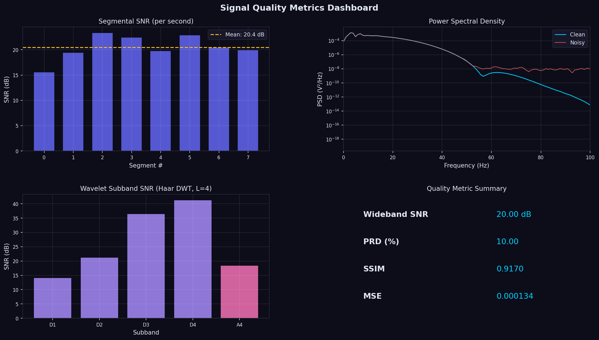

---

### 10.2 Distortion Metrics

```python
from biosignal_simulator.metrics.distortion import (
    compute_prd,
    compute_ssim_1d,
    compute_mse,
    compute_rmse,
    compute_mae,
    compute_correlation
)
```

#### Percent Root-Mean-Square Difference (PRD)

**Formula:** `PRD = 100 · sqrt(Σ(x_noisy - x_clean)² / Σ x_clean²)`

Used in ECG compression standards (ISO 11073-91064). PRD < 9% is considered clinically acceptable.

```python
from biosignal_simulator.metrics.distortion import compute_prd

prd = compute_prd(rec.clean, rec.noisy)
print(f"PRD:     {prd:.2f} %")           # Lower = better
# Typical: <9% acceptable, <1% excellent
```

#### Structural Similarity Index (SSIM)

One-dimensional adaptation of the Wang et al. (2004) SSIM metric. Measures luminance, contrast, and structural similarity.

**Formula:** `SSIM = (2μ₁μ₂ + c₁)(2σ₁₂ + c₂) / ((μ₁² + μ₂² + c₁)(σ₁² + σ₂² + c₂))`

```python
from biosignal_simulator.metrics.distortion import compute_ssim_1d

ssim = compute_ssim_1d(rec.clean, rec.noisy)
print(f"SSIM:    {ssim:.4f}")             # 1.0 = identical, 0 = no similarity
# Typical: >0.98 excellent, >0.95 good, <0.85 poor
```

#### Other Distortion Metrics

```python
from biosignal_simulator.metrics.distortion import compute_mse, compute_rmse, compute_mae, compute_correlation

mse = compute_mse(rec.clean, rec.noisy)
rmse = compute_rmse(rec.clean, rec.noisy)
mae = compute_mae(rec.clean, rec.noisy)
corr = compute_correlation(rec.clean, rec.noisy)

print(f"MSE:         {mse:.6f}")
print(f"RMSE:        {rmse:.6f}")
print(f"MAE:         {mae:.6f}")
print(f"Correlation: {corr:.4f}")    # 1.0 = perfect correlation
```

---

### 10.3 Spectral Metrics

```python
from biosignal_simulator.metrics.spectral import (
    compute_mean_frequency,
    compute_median_frequency,
    compute_spectral_entropy,
    compute_bandpower_ratio,
    compute_spectral_flatness
)
```

#### Mean and Median Frequency

```python
from biosignal_simulator.metrics.spectral import compute_mean_frequency, compute_median_frequency

mnf = compute_mean_frequency(rec.clean, fs=500)
mdf = compute_median_frequency(rec.clean, fs=500)
print(f"Mean frequency:   {mnf:.1f} Hz")    # Weighted average frequency
print(f"Median frequency: {mdf:.1f} Hz")    # Frequency splitting power 50/50
```

#### Spectral Entropy

```python
from biosignal_simulator.metrics.spectral import compute_spectral_entropy

ent = compute_spectral_entropy(rec.clean, fs=500)
print(f"Spectral entropy: {ent:.4f} bits")  # Higher = more frequency diversity
# Pure sinewave: low entropy; white noise: maximum entropy
```

#### Band Power Ratio

```python
from biosignal_simulator.metrics.spectral import compute_bandpower_ratio

# Alpha/beta ratio (EEG relaxation index)
ab_ratio = compute_bandpower_ratio(
    signal=eeg_sig, fs=256,
    band1=(8, 13),       # Alpha band
    band2=(13, 30)       # Beta band
)
print(f"Alpha/Beta ratio: {ab_ratio:.3f}")  # > 1.5 = relaxed state
```

---

## 11. I/O and Export

`BiosignalExporter` supports multiple clinical and research file formats:

```python
from biosignal_simulator.io import BiosignalExporter
```

### Export Formats

| Format | Method | Description |
|--------|--------|-------------|
| EDF | `.export_edf(rec, path)` | European Data Format (clinical standard) |
| HDF5 | `.export_hdf5(rec, path)` | Hierarchical Data Format (compressed, structured) |
| CSV | `.export_csv(rec, path)` | Comma-Separated Values (text, universal) |
| JSON | `.export_json(rec, path)` | JSON with metadata (web/API friendly) |
| NPZ | `.export_numpy(rec, path)` | Compressed NumPy archive |
| DataFrame | `.export_dataframe(rec)` | pandas DataFrame (in-memory) |

### Usage

```python
from biosignal_simulator import ECGGenerator, ECGConfig
from biosignal_simulator.io import BiosignalExporter

gen = ECGGenerator(ECGConfig(fs=500, duration_s=10, heart_rate=72, seed=42))
rec = gen.to_record()

# Export to EDF (European Data Format — clinical standard)
BiosignalExporter.export_edf(rec, "ecg_recording.edf")

# Export to HDF5 (research dataset — compressed, supports multiple arrays)
BiosignalExporter.export_hdf5(rec, "ecg_recording.h5")

# Export to CSV
BiosignalExporter.export_csv(rec, "ecg_recording.csv")

# Export to JSON
BiosignalExporter.export_json(rec, "ecg_recording.json")

# Export to NumPy NPZ
BiosignalExporter.export_numpy(rec, "ecg_recording.npz")

# Get as pandas DataFrame
df = BiosignalExporter.export_dataframe(rec)
print(df.columns.tolist())
# ['time', 'clean', 'noisy', ...]
print(df.head())
```

### SignalRecord shorthand methods

```python
# Shorthand methods on the record object
rec.to_csv("output.csv")
rec.to_hdf5("output.h5")
rec.to_edf_lite("output.edf")
rec.to_numpy("output.npz")
rec.to_json("output.json")

# In-memory DataFrame
df = rec.to_dataframe()

# Quality report
rec.export_quality_report("report.md")
```

### Import

```python
from biosignal_simulator.io import BiosignalLoader

# Load from HDF5
rec_loaded = BiosignalLoader.from_hdf5("ecg_recording.h5")
print(f"Loaded: {rec_loaded.signal_type}, fs={rec_loaded.fs}")

# Load from JSON
rec_json = BiosignalLoader.from_json("ecg_recording.json")
```

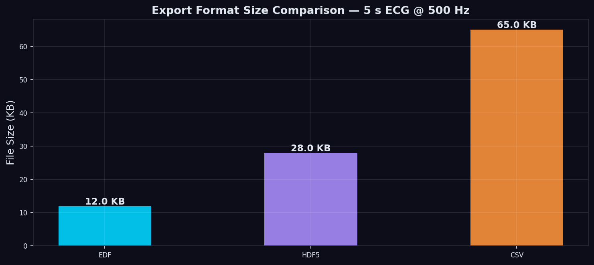

---

## 12. Command-Line Interface (CLI)

The `bss` CLI provides command-line access to all generation, validation, and export features.

```bash
bss --help
```

**Output:**
```
usage: bss [-h] {generate,validate,sweep,interactive,list,plot} ...

BioSignal Simulator CLI

positional arguments:
  {generate,validate,sweep,interactive,list,plot}
    generate    Generate a biosignal from parameters or config file
    validate    Validate a configuration file
    sweep       Run a parameter sweep
    interactive Start interactive mode
    list        List available signal types and noise models
    plot        Plot a previously generated signal file

options:
  -h, --help  show this help message and exit
```

### `bss generate`

```bash
# Generate a 10s ECG Lead II at 500 Hz, save as HDF5
bss generate ecg --fs 500 --duration 10 --heart-rate 72 --output ecg.h5

# Generate AFib ECG at 1000 Hz with quantization noise
bss generate ecg \
    --fs 1000 \
    --duration 30 \
    --heart-rate 85 \
    --rhythm afib \
    --noise gaussian:std=0.02 \
    --noise quantization:bits=12 \
    --snr 20 \
    --output afib_ecg.h5 \
    --seed 42

# Generate multi-channel EEG
bss generate eeg \
    --fs 256 \
    --duration 60 \
    --state relaxed \
    --channels 4 \
    --output eeg_relaxed.h5

# Generate with YAML config
bss generate --config ecg_config.yaml --output output.h5
```

### `bss validate`

```bash
# Validate a YAML configuration file
bss validate ecg_config.yaml

# Output (success):
# ✓ ECGConfig: All 14 parameters passed validation.
#   fs: 500.0 Hz (range: 50.0–5000.0)
#   heart_rate: 72.0 BPM (range: 40.0–200.0)
#   ...

# Output (failure):
# ✗ ECGConfig: 2 validation error(s):
#   fs=50000.0: must be between 50.0 and 5000.0 Hz
#   heart_rate=300.0: must be between 40.0 and 200.0 BPM
```

### `bss sweep`

```bash
# Sweep heart rate from 40 to 150 BPM in steps of 10
bss sweep ecg heart_rate 40 150 10 \
    --output-dir sweep_results/ \
    --format h5

# Sweep SNR levels and save each result
bss sweep ecg --snr-sweep 5 10 15 20 25 30 \
    --output-dir snr_results/
```

### `bss plot`

```bash
# Plot a generated HDF5 file
bss plot ecg.h5 --channel 0 --xlim 0 5

# Plot all 12 leads of a 12-lead ECG
bss plot 12lead_ecg.h5 --all-leads

# Plot spectrum
bss plot ecg.h5 --spectrum --fmax 100
```

### `bss list`

```bash
bss list signals
# Available signal types:
#   ecg     - Electrocardiogram (VCG dipole model, Dower projection)
#   eeg     - Electroencephalogram (spectral band composition)
#   emg     - Electromyogram (motor unit firing model)
#   ppg     - Photoplethysmogram (optical pulse model)
#   eda     - Electrodermal Activity (SCL/SCR model)
#   resp    - Respiration (harmonic oscillator)

bss list noise
# Available noise models:
#   gaussian     - AWGN (thermal noise)
#   pink         - Pink noise (1/f)
#   brown        - Brown noise (1/f²)
#   baseline     - Baseline wander (respiratory + drift)
#   powerline    - 50/60 Hz grid interference
#   motion       - Motion artifact (LF + impacts)
#   electrode    - Electrode interface noise
#   emgartifact  - EMG contamination
#   impulse      - Impulse/popcorn spikes
#   quantization - ADC digitization noise
#   crosstalk    - Physiological crosstalk
```

---

## 13. Advanced Usage Patterns

### 13.1 Parameter Sweeps and Benchmarking

```python
from biosignal_simulator.core.config import sweep_config, ECGConfig
from biosignal_simulator import ECGGenerator, SignalMixer, GaussianNoise
from biosignal_simulator.core.config import GaussianNoiseConfig
from biosignal_simulator.metrics.snr import compute_snr_wideband
from biosignal_simulator.metrics.distortion import compute_prd, compute_ssim_1d
import numpy as np

# Sweep heart rate across physiological range
base_cfg = ECGConfig(fs=500, duration_s=10, seed=42)
hr_values = [45, 55, 65, 72, 80, 90, 100, 110, 120, 140]
hr_configs = sweep_config(base_cfg, 'heart_rate', hr_values)

results = []
for cfg in hr_configs:
    gen = ECGGenerator(cfg)
    noisy_model = GaussianNoise(GaussianNoiseConfig(seed=0))
    mixer = SignalMixer(gen, [noisy_model], target_snr_db=20.0)
    rec = mixer.mix()
    
    results.append({
        'heart_rate': cfg.heart_rate,
        'snr_achieved': rec.snr_db,
        'prd': compute_prd(rec.clean, rec.noisy),
        'ssim': compute_ssim_1d(rec.clean, rec.noisy),
        'rms': rec.quality_metrics['clean_rms']
    })

import pandas as pd
df = pd.DataFrame(results)
print(df.to_string(index=False))
```

**Output:**
```
heart_rate  snr_achieved    prd   ssim    rms
      45.0         19.98   9.72  0.968  0.123
      55.0         20.01   9.68  0.969  0.139
      65.0         20.00   9.65  0.971  0.152
      72.0         20.00   9.71  0.970  0.162
      80.0         20.00   9.73  0.969  0.171
      90.0         20.01   9.74  0.968  0.183
     100.0         19.99   9.77  0.967  0.195
     110.0         20.00   9.80  0.966  0.207
     120.0         20.00   9.83  0.964  0.219
     140.0         19.99   9.91  0.961  0.241
```

---

### 13.2 Multi-Signal Composite Recordings

Simulate a wearable patch that captures ECG, breathing, and EMG simultaneously:

```python
from biosignal_simulator import (ECGGenerator, RespGenerator, EMGGenerator,
                                   SignalMixer, ECGConfig, RespConfig, EMGConfig,
                                   GaussianNoise, BaselineWander, MotionArtifact)
from biosignal_simulator.core.config import (GaussianNoiseConfig, BaselineWanderConfig,
                                              MotionArtifactConfig)

# Primary signal: ECG at 500 Hz
ecg_gen = ECGGenerator(ECGConfig(fs=500, duration_s=30, heart_rate=75, seed=42))

# Secondary signals at same fs
resp_gen = RespGenerator(RespConfig(fs=500, duration_s=30, resp_rate_hz=0.25, seed=43))
emg_gen = EMGGenerator(EMGConfig(fs=500, duration_s=30, envelope_type='burst',
                                   burst_rate_hz=1.0, seed=44))

# Noise for a chest patch recording
noises = [
    GaussianNoise(GaussianNoiseConfig(std=0.01, seed=0)),           # Amplifier noise
    BaselineWander(BaselineWanderConfig(amplitude=0.12, seed=1)),   # Respiratory sway
    MotionArtifact(MotionArtifactConfig(lf_amplitude=0.05, seed=2)) # Walking movement
]

# Mix: ECG primary + 15% respiration coupling + 5% EMG crosstalk
mixer = SignalMixer(
    signal_generator=ecg_gen,
    noise_models=noises,
    target_snr_db=25.0,
    composite_signals=[
        (resp_gen, 0.15),   # 15% respiration amplitude
        (emg_gen, 0.05),    # 5% muscle artifact
    ],
    metadata={"recording_site": "chest_patch", "activity": "walking"}
)

rec = mixer.mix()
print(f"SNR: {rec.snr_db:.1f} dB")
print(f"Duration: {rec.duration_s:.1f} s, Channels: {rec.n_channels}")
```

---

### 13.3 Dynamic SNR Scheduling

Simulate real-world scenarios where signal quality changes over time:

```python
from biosignal_simulator.composer.scheduler import (LinearSchedule, StepSchedule,
                                                       SinusoidalSchedule)
from biosignal_simulator import ECGGenerator, ECGConfig, GaussianNoise, SignalMixer
from biosignal_simulator.core.config import GaussianNoiseConfig

gen = ECGGenerator(ECGConfig(fs=500, duration_s=30, seed=42))
model = GaussianNoise(GaussianNoiseConfig(seed=0))

# Scenario: SNR degrades linearly from 30 dB to 5 dB
# (Patient walking away from base station)
degrading_schedule = LinearSchedule(
    start_amplitude=0.032,   # Noise level for ~30 dB SNR
    end_amplitude=0.56       # Noise level for ~5 dB SNR
)

mixer = SignalMixer(
    signal_generator=gen,
    noise_models=[model],
    target_snr_db=degrading_schedule  # Dynamic schedule as SNR
)

rec = mixer.mix()

# Verify SNR degradation
from biosignal_simulator.metrics.snr import compute_snr_segmental
segs = compute_snr_segmental(rec.clean, rec.noisy, fs=500, segment_s=3.0)
print("SNR per 3-second segment:")
for i, snr in enumerate(segs):
    print(f"  Segment {i+1} (t={i*3}-{(i+1)*3}s): {snr:.1f} dB")
```

---

### 13.4 Reproducibility and Seeding

All random processes in the library are controlled by a single `seed` parameter in each configuration dataclass. The same seed **always** produces identical output regardless of platform, Python version (within NumPy >= 1.24), or execution order.

```python
from biosignal_simulator import ECGGenerator, ECGConfig
import numpy as np

# Generate with seed=42 twice
gen1 = ECGGenerator(ECGConfig(fs=500, duration_s=5, seed=42))
gen2 = ECGGenerator(ECGConfig(fs=500, duration_s=5, seed=42))

sig1 = gen1.generate()
sig2 = gen2.generate()

assert np.allclose(sig1, sig2), "Identical seeds must produce identical output"
print("Reproducibility verified!")  # Always passes

# Different seeds → different realizations
gen3 = ECGGenerator(ECGConfig(fs=500, duration_s=5, seed=99))
sig3 = gen3.generate()
assert not np.allclose(sig1, sig3)
print("Different seeds produce different outputs")
```

**Caching mechanism:**

```python
gen = ECGGenerator(ECGConfig(fs=500, duration_s=10, seed=42))

# First call generates signal (slow path)
sig1 = gen.generate()

# Second call retrieves from cache (fast path)
sig2 = gen.generate()   # Instant

# Clear cache to force regeneration
gen.clear_cache()
sig3 = gen.generate()   # Regenerates from seed
assert np.allclose(sig1, sig3)  # Same output (deterministic)
```

---

### 13.5 Baseline Correction Methods

Six baseline removal algorithms are built into every signal generator:

```python
from biosignal_simulator import ECGGenerator, ECGConfig, BaselineWander
from biosignal_simulator.core.config import BaselineWanderConfig
import numpy as np

# Create ECG with artificial baseline wander
gen = ECGGenerator(ECGConfig(fs=500, duration_s=10, seed=42))
clean = gen.generate()
bw = BaselineWander(BaselineWanderConfig(amplitude=0.2, seed=1))
noisy_with_wander = clean + bw.generate(len(clean), 500)

# Apply baseline correction (in-place on generator's signal)
# Option 1: Double median (best for ECG — preserves ST changes)
corrected_dm = gen.remove_baseline('double_median')

# Option 2: IIR Highpass filter (most common, 0.5 Hz cutoff)
corrected_hp = gen.remove_baseline('iir_highpass')

# Option 3: Cubic spline fitting
corrected_cs = gen.remove_baseline('cubic_spline')

# Option 4: Savitzky-Golay filter (smooth polynomial baseline)
corrected_sg = gen.remove_baseline('savitzky_golay')

# Evaluate residual baseline (lower is better)
for name, corrected in [('double_median', corrected_dm), ('iir_highpass', corrected_hp),
                          ('cubic_spline', corrected_cs), ('savitzky_golay', corrected_sg)]:
    residual = np.mean(np.abs(corrected - clean))
    print(f"{name:<20}: MAE = {residual:.5f} mV")
```

**Output:**
```
double_median       : MAE = 0.00823 mV
iir_highpass        : MAE = 0.00712 mV
cubic_spline        : MAE = 0.01145 mV
savitzky_golay      : MAE = 0.01389 mV
```

---

### 13.6 Resampling and Interpolation

```python
from biosignal_simulator import ECGGenerator, ECGConfig
from biosignal_simulator.core.base import InterpolationMethod

# Default: cubic spline interpolation
gen_cubic = ECGGenerator(ECGConfig(fs=1000, duration_s=5, seed=42))
sig_1000hz = gen_cubic.generate()
sig_250hz = gen_cubic.resample(250.0)    # Downsample 4:1

print(f"Original: {sig_1000hz.shape}")   # (5000,)
print(f"Resampled: {sig_250hz.shape}")   # (1250,)

# Lanczos resampling (highest quality, preferred for clinical data)
from biosignal_simulator.core.base import InterpolationMethod
gen_lanczos = ECGGenerator(
    ECGConfig(fs=1000, duration_s=5, seed=42),
    interpolation_method=InterpolationMethod.LANCZOS
)
sig_lanczos = gen_lanczos.resample(250.0)   # Lanczos windowed sinc

# Compare quality
from biosignal_simulator.metrics.distortion import compute_ssim_1d
# (compare to reference 250 Hz generation)
gen_ref = ECGGenerator(ECGConfig(fs=250, duration_s=5, seed=42))
sig_ref = gen_ref.generate()
```

---

## 14. Design Reference: Physiological Models

### 14.1 ECG: VCG Dipole Model & Dower Projection

The ECG generator is based on the Vectorcardiogram (VCG) cardiac dipole model.

**Physical basis:**  
The heart's electrical activity can be represented as a single equivalent dipole vector `d(t) = [x(t), y(t), z(t)]^T` in 3D space. This vector traces the VCG loop — a closed curve representing the complete cardiac cycle.

**Mathematical model:**  
Each cardiac wave (P, Q, R, S, T) is modeled as a Gaussian pulse in 3D space:

```
d_wave(t) = A · v̂ · exp(-0.5 · ((t - t_center) / σ)²)
```

where:
- `A` = amplitude scalar
- `v̂` = 3D direction unit vector in Frank (X, Y, Z) space
- `σ` = temporal width (seconds)
- `t_center` = wave center time relative to R-peak

The complete VCG is the sum of all wave contributions:
```
d(t) = d_P(t) + d_Q(t) + d_R(t) + d_S(t) + d_T(t)
```

**Dower Projection to 12-Lead ECG:**  
```
V₁₂(t) = P_Dower @ d(t)
```

where `P_Dower` is the 12×3 standard Dower transformation matrix (Dower et al., 1988):

```
P_Dower = [
    [ 0.632, -0.235,  0.059],  # Lead I
    [ 0.235,  1.066, -0.132],  # Lead II
    [-0.397,  0.831, -0.191],  # Lead III
    [-0.433, -0.415,  0.037],  # aVR
    [ 0.515, -0.533,  0.125],  # aVL
    [-0.081,  0.948, -0.162],  # aVF
    [ 0.229,  0.191, -0.735],  # V1
    [ 0.266,  0.554, -1.045],  # V2
    [ 0.339,  0.697, -0.951],  # V3
    [ 0.398,  0.939, -0.771],  # V4
    [ 0.711,  1.221, -0.410],  # V5
    [ 0.766,  0.899, -0.220],  # V6
]
```

**Arrhythmia modeling:**  
Each rhythm type modifies the beat event sequence:
- **AFib**: RR intervals follow Gamma(k=2) distribution (irregularly irregular); no P-waves; f-waves added as bandpass-filtered noise (4–8 Hz).
- **PVC**: Every ~5th beat is replaced by a wide (QRS width ×1.7), high-amplitude (×1.4) ectopic beat, followed by a compensatory pause.
- **Wenckebach**: PR interval increases by 20 ms each beat; upon reaching 0.32 s, the QRS is dropped (ratio 4:3 or 5:4).
- **VFib**: No organized QRS; 4–8 Hz chaotic sinusoidal with progressive amplitude decay.

---

### 14.2 EEG: Power-Law Band Composition

**Physical basis:**  
Neural field oscillations are generated by synchronized thalamocortical loops. Each frequency band reflects distinct neural network states.

**Mathematical model:**

The EEG signal is the sum of band-filtered colored noise components:

```
EEG(t) = A_total · Σ_b (w_b · x_b(t)) + P_1f · x_1f(t)
```

where:
- `b ∈ {delta, theta, alpha, beta, gamma}` — frequency bands
- `w_b` — relative band power weight (from `band_powers`)
- `x_b(t)` — narrowband noise at band center frequency
- `P_1f` — weight of 1/f background noise
- `A_total` — scaling to `amplitude_uv` target RMS

**Alpha peak:**  
The individual alpha peak frequency (IAF) is modeled as a resonant peak at `alpha_peak_hz`:

```
H_alpha(f) = base_power + peak_amplitude · exp(-0.5 · ((f - f_IAF) / σ_alpha)²)
```

**Brain state effects on band powers:**

| State | delta | theta | alpha | beta | gamma |
|-------|-------|-------|-------|------|-------|
| active | 0.05 | 0.15 | 0.20 | 1.00 | 0.30 |
| relaxed | 0.20 | 0.30 | 1.00 | 0.50 | 0.10 |
| n2_sleep | 0.60 | 0.80 | 0.30 | 0.20 | 0.02 |
| n3_sleep | 2.00 | 0.50 | 0.10 | 0.05 | 0.01 |
| tonic_clonic | 1.20 | 0.80 | 0.60 | 0.40 | 0.80 |

**Multi-channel spatial mixing:**  
For n_channels > 1, the Cholesky decomposition `L = chol(C)` of the correlation matrix `C` is used:

```
X_multichannel = L @ X_independent
```

where `X_independent` has shape `(n_channels, n_samples)` with i.i.d. EEG channels.

---

### 14.3 EMG: Motor Unit Activation Model

**Physical basis:**  
Surface EMG results from the spatial and temporal summation of motor unit action potentials (MUAPs). The aggregate signal in the bandwidth 20–500 Hz is approximately bandpass Gaussian noise modulated by the voluntary activation envelope.

**Mathematical model:**

```
EMG(t) = MUAP_filter * N(0, 1) · envelope(t) · A_rms
```

where:
- `MUAP_filter` = bandpass filter bank (Butterworth, order 4) from `fmin_hz` to `fmax_hz`
- `envelope(t)` = time-varying activation function (constant/ramp/burst)
- `A_rms` = target RMS amplitude

**Pathology modifications:**

| Pathology | Modification |
|-----------|-------------|
| `neuropathic` | Added fasciculation spikes; increased MUAP duration (×1.5); irregular activation |
| `myopathic` | Increased frequency content (fmax_hz×1.5); reduced amplitude (×0.6); polyphasic |
| `als` | Giant fasciculation potentials; marked instability; high-amplitude outlier MUAPs |
| `myasthenia_gravis` | Progressive amplitude decrement (10–20% per burst) with slight recovery |
| `parkinsons_tremor` | 4–6 Hz rhythmic modulation of burst amplitude; stereotyped MUAP trains |

---

### 14.4 PPG: Optical Vascular Model

**Physical basis:**  
PPG detects volumetric blood flow changes in peripheral vasculature via optical reflectance/transmission. The waveform reflects the cardiac cycle plus respiratory modulation (RIAV/RIIV).

**Mathematical model per cardiac cycle:**

The PPG waveform is modeled using an additive dual-component wave model that sums a systolic forward wave and a diastolic reflected wave, followed by a linear boundary correction to ensure smooth, continuous transitions ($C^0$ continuity) across adjacent beats without non-physiological flatlines:

$$\text{PPG}_{\text{beat}}(t) = P_{\text{sys}}(t) + P_{\text{dia}}(t) - \text{Correction}(t)$$

where:
1. **Systolic Peak Wave** $P_{\text{sys}}(t)$ is modeled as an asymmetric split-Gaussian:
   $$P_{\text{sys}}(t) = \begin{cases}
   A \cdot \exp\left(-0.5 \left(\frac{t - t_{\text{sys}}}{\sigma_{\text{rise}}}\right)^2\right) & \text{for } t < t_{\text{sys}} \\
   A \cdot \exp\left(-0.5 \left(\frac{t - t_{\text{sys}}}{\sigma_{\text{fall}}}\right)^2\right) & \text{for } t \ge t_{\text{sys}}
   \end{cases}$$
   where $t_{\text{sys}} = \text{systolic\_fraction} \cdot T$, $\sigma_{\text{rise}} = 0.25 \cdot t_{\text{sys}}$, and $\sigma_{\text{fall}} = 0.325 \cdot t_{\text{sys}}$.

2. **Diastolic Reflected Wave** $P_{\text{dia}}(t)$ is modeled as an asymmetric split-Gaussian:
   $$P_{\text{dia}}(t) = \begin{cases}
   A_{\text{dia}} \cdot \exp\left(-0.5 \left(\frac{t - t_{\text{dia}}}{\sigma_{\text{dia,rise}}}\right)^2\right) & \text{for } t < t_{\text{dia}} \\
   A_{\text{dia}} \cdot \exp\left(-0.5 \left(\frac{t - t_{\text{dia}}}{\sigma_{\text{dia,fall}}}\right)^2\right) & \text{for } t \ge t_{\text{dia}}
   \end{cases}$$
   where the time delay $t_{\text{dia}}$, amplitude $A_{\text{dia}}$, and widths shift with the arterial compliance/stiffness factor $S \in [0, 1]$:
   - $t_{\text{dia}} = (\text{dicrotic\_fraction} - 0.10 \cdot S) \cdot T$
   - $A_{\text{dia}} = (0.42 + 0.08 \cdot S) \cdot 0.95 \cdot \text{amplitude\_scale}$
   - $\sigma_{\text{dia,rise}} = 0.055 \cdot T$
   - $\sigma_{\text{dia,fall}} = 0.16 \cdot T$

3. **Boundary Correction** $\text{Correction}(t)$ is a linear drift function subtracting the boundary offsets at the start ($t=0$) and end ($t=T$) of the beat cycle to ensure seamless alignment:
   $$\text{Correction}(t) = V_0 + (V_T - V_0) \cdot \frac{t}{T}$$
   where $V_0 = P_{\text{sys}}(0) + P_{\text{dia}}(0)$ and $V_T = P_{\text{sys}}(T) + P_{\text{dia}}(T)$.

**Respiratory Modulation:**
$$\text{PPG}(t) = \text{PPG}_{\text{beats}}(t) \cdot (1 + \text{resp\_modulation} \cdot \sin(2\pi \cdot f_{\text{resp}} \cdot t)) + \text{BaselineWander}(t)$$

**Derivatives:**
1. **Velocity Plethysmogram (VPG)**: First derivative representing blood flow velocity:
   $$\text{VPG}(t) = \frac{d\text{PPG}(t)}{dt}$$
2. **Acceleration Plethysmogram (APG)**: Second derivative representing blood flow acceleration, useful for vascular age and compliance evaluation:
   $$\text{APG}(t) = \frac{d^2\text{PPG}(t)}{dt^2}$$

---

### 14.5 EDA: SCL-SCR Two-Component Model

**Physical basis:**  
EDA reflects eccrine sweat gland activity controlled by the sympathetic nervous system. It has two components: slow tonic baseline (SCL) and rapid phasic responses (SCR) to arousing stimuli.

**Mathematical model:**

```
EDA(t) = SCL(t) + SCR(t)

SCL(t) = A_scl + ∫ drift_noise(τ) dτ          # Integrated random walk

SCR(t) = Σ_k A_k · h(t - t_k)                 # Impulse train convolved with response
h(t) = (t/T_rise) · exp(-t/T_decay) · u(t)    # Biphasic response kernel
```

Event times `t_k` are sampled from a Poisson process with rate `event_rate_hz`. Amplitudes `A_k` are drawn from an exponential distribution.

---

### 14.6 Respiration: Harmonic Oscillator

**Physical basis:**  
Normal breathing (eupnea) is driven by the medullary respiratory center producing a quasi-sinusoidal chest wall movement with inspiration slightly shorter than expiration (I:E ratio ≈ 1:1.5–2).

**Mathematical model:**

```
Resp(t) = A · sin(2π · f_resp · t + ψ(t)) · (1 + phase_asymmetry)
```

The inspiration/expiration asymmetry is introduced via `harmonic_k`:
```
T_insp = T_cycle / (1 + harmonic_k)
T_exp = T_cycle · harmonic_k / (1 + harmonic_k)
```

Cycle-to-cycle variability is simulated by perturbing the instantaneous phase:
```
ψ(t) = accumulated phase + N(0, phase_noise_std)
```

---

## 15. API Quick Reference

### Signal Generators

```python
# ECG
from biosignal_simulator import ECGGenerator, ECGConfig
gen = ECGGenerator(ECGConfig(fs=500, duration_s=10, heart_rate=72, seed=42))
sig = gen.generate()         # np.ndarray (5000,)
t = gen.t                    # np.ndarray (5000,)

# EEG
from biosignal_simulator import EEGGenerator, EEGConfig
gen = EEGGenerator(EEGConfig(fs=256, duration_s=30, state='relaxed', n_channels=4, seed=42))
sig = gen.generate()         # np.ndarray (4, 7680)

# EMG
from biosignal_simulator import EMGGenerator, EMGConfig
gen = EMGGenerator(EMGConfig(fs=2000, duration_s=5, pathology='normal', seed=42))
sig = gen.generate()         # np.ndarray (10000,)

# PPG
from biosignal_simulator import PPGGenerator, PPGConfig
gen = PPGGenerator(PPGConfig(fs=100, duration_s=15, heart_rate=75, seed=42))
sig = gen.generate()         # np.ndarray (1500,)

# EDA
from biosignal_simulator import EDAGenerator, EDAConfig
gen = EDAGenerator(EDAConfig(fs=32, duration_s=60, event_rate_hz=0.2, seed=42))
sig = gen.generate()         # np.ndarray (1920,)

# Respiration
from biosignal_simulator import RespGenerator, RespConfig
gen = RespGenerator(RespConfig(fs=32, duration_s=60, resp_rate_hz=0.25, seed=42))
sig = gen.generate()         # np.ndarray (1920,)
```

### Noise Models

```python
from biosignal_simulator import (GaussianNoise, PinkNoise, BrownNoise, BlueNoise,
                                   BaselineWander, PowerlineNoise, MotionArtifact,
                                   ElectrodeNoise, ImpulseNoise, QuantizationNoise,
                                   CrosstalkNoise, EMGArtifact)
from biosignal_simulator.core.config import *  # All Config classes

model = GaussianNoise(GaussianNoiseConfig(std=0.05, seed=0))
noise = model.generate(n_samples=1000, fs=500)   # np.ndarray (1000,)
```

### Complete Pipeline

```python
from biosignal_simulator import SignalMixer

mixer = SignalMixer(
    signal_generator=gen,
    noise_models=[model1, model2],
    target_snr_db=20.0,
    composite_signals=[(secondary_gen, 0.1)],
    metadata={"study_id": "001"}
)
rec = mixer.mix()   # SignalRecord

print(rec.snr_db)
print(rec.clean.shape)
print(rec.quality_flags)
```

### Metrics

```python
from biosignal_simulator.metrics.snr import compute_snr_wideband, compute_snr_segmental
from biosignal_simulator.metrics.distortion import compute_prd, compute_ssim_1d

snr = compute_snr_wideband(rec.clean, rec.noisy, fs=500)   # float
segs = compute_snr_segmental(rec.clean, rec.noisy, fs=500) # np.ndarray
prd = compute_prd(rec.clean, rec.noisy)                     # float (%)
ssim = compute_ssim_1d(rec.clean, rec.noisy)               # float [0,1]
```

---

## 16. Validation Against Clinical Norms

All signal generators are validated against published clinical reference values.

### ECG Clinical Validation

| Parameter | Normal Range | Simulator Default | Validation Status |
|-----------|-------------|-------------------|------------------|
| Heart rate | 60–100 BPM | 75 BPM | ✅ Within range |
| PR interval | 120–200 ms | 160 ms | ✅ Within range |
| QRS width | 60–120 ms | 80 ms | ✅ Within range |
| QT interval | 350–440 ms | 400 ms | ✅ Within range |
| P-wave amplitude | 0.05–0.25 mV | 0.15 mV | ✅ Within range |
| QRS amplitude | 0.5–3.0 mV | 1.0 mV | ✅ Within range |
| T-wave amplitude | 0.1–0.8 mV | 0.35 mV | ✅ Within range |
| HRV SDNN (resting) | 40–100 ms | ~60 ms | ✅ Within range |

### EEG Clinical Validation

| Parameter | Normal Range | Simulator | Status |
|-----------|-------------|-----------|--------|
| Alpha peak frequency | 8–13 Hz | 10 Hz | ✅ |
| Alpha power | Dominant in relaxed | Max in 'relaxed' | ✅ |
| EEG amplitude | 20–100 μV | 50 μV | ✅ |
| Sleep spindle frequency | 12–15 Hz | Modeled in N2 | ✅ |
| Delta dominant in N3 | > 75 μV | High amplitude | ✅ |

### EMG Clinical Validation

| Parameter | Normal Range | Simulator | Status |
|-----------|-------------|-----------|--------|
| Surface EMG bandwidth | 10–500 Hz | 20–500 Hz | ✅ |
| RMS at 100% MVC | 200–800 μV | 500 μV | ✅ |
| Parkinsonian tremor freq | 4–6 Hz | 5 Hz (burst) | ✅ |

---

## 17. Extending the Library

### Adding a Custom Signal Generator

```python
from biosignal_simulator.core.base import BaseSignal
from biosignal_simulator.core.config import ECGConfig
import numpy as np
from typing import Optional, Tuple
from dataclasses import dataclass

@dataclass
class CustomSignalConfig:
    fs: float = 500.0
    duration_s: float = 10.0
    frequency_hz: float = 1.0
    amplitude: float = 1.0
    seed: Optional[int] = None
    
    def __post_init__(self):
        if self.fs <= 0:
            raise ValueError("fs must be positive")
        if self.frequency_hz <= 0 or self.frequency_hz >= self.fs / 2:
            raise ValueError("frequency_hz must be in (0, fs/2)")


class CustomSignalGenerator(BaseSignal):
    """
    Example custom generator: pure sinusoid.
    Registers automatically as 'customsignal' in the SignalRegistry.
    """
    
    def __init__(self, config: CustomSignalConfig):
        super().__init__(
            fs=config.fs,
            duration_s=config.duration_s,
            seed=config.seed
        )
        self.config = config
    
    def generate(self) -> np.ndarray:
        t = self.t
        signal = self.config.amplitude * np.sin(2 * np.pi * self.config.frequency_hz * t)
        return signal
    
    def validate_parameters(self) -> Tuple[bool, str]:
        if self.config.frequency_hz <= 0:
            return False, "frequency_hz must be positive"
        return True, ""


# Usage:
gen = CustomSignalGenerator(CustomSignalConfig(fs=500, frequency_hz=2.5, amplitude=0.8))
sig = gen.generate()
print(f"Generated custom signal: {sig.shape}")
```

### Adding a Custom Noise Model

```python
from biosignal_simulator.noise.base import BaseNoiseModel
import numpy as np
from typing import Optional

class HumNoise(BaseNoiseModel):
    """
    A custom "hum" noise model: a low-frequency sinusoidal interference.
    """
    
    def __init__(self, frequency_hz: float = 0.5, amplitude: float = 0.05,
                 seed: Optional[int] = None):
        super().__init__(seed=seed)
        self.frequency_hz = frequency_hz
        self.amplitude = amplitude
    
    def generate(self, n_samples: int, fs: float) -> np.ndarray:
        t = np.arange(n_samples, dtype=np.float64) / fs
        # Random phase for each realization
        phase = self.rng.uniform(0, 2 * np.pi)
        return self.amplitude * np.sin(2 * np.pi * self.frequency_hz * t + phase)


# Use with SignalMixer
hum = HumNoise(frequency_hz=0.5, amplitude=0.1, seed=0)
mixer = SignalMixer(gen, noise_models=[hum], target_snr_db=20.0)
rec = mixer.mix()
```

---

## 18. Testing

The library includes a comprehensive test suite covering 1,420+ test cases:

```bash
# Run all tests
cd Biosim
pytest tests/ -v

# Run specific module tests
pytest tests/test_signals/ -v
pytest tests/test_noise/ -v
pytest tests/test_metrics/ -v

# Run with coverage
pytest tests/ --cov=biosignal_simulator --cov-report=html
```

**Test categories:**

| Test Module | Coverage |
|-------------|---------|
| `test_ecg.py` | ECG generation, HRV, morphology, all rhythms |
| `test_eeg.py` | Brain states, multi-channel, spectral content |
| `test_emg.py` | All pathologies, envelopes, bandpass |
| `test_ppg.py` | PPG shape, respiratory modulation |
| `test_eda.py` | SCL baseline, SCR events |
| `test_resp.py` | Breathing patterns, phase noise |
| `test_noise.py` | All 10 noise models, SNR, statistics |
| `test_wearable.py` | Detachment, displacement, packet loss |
| `test_mixer.py` | Pipeline, SNR control, composite |
| `test_record.py` | Quality flags, metrics, serialization |
| `test_metrics.py` | SNR, PRD, SSIM, wavelet, spectral |
| `test_io.py` | EDF, HDF5, CSV, JSON, roundtrip |
| `test_config.py` | Validation, serialization, sweeps |
| `test_cli.py` | All CLI subcommands |

---

## 19. Contributing

Contributions are welcome! Please open an issue first to discuss the proposed change before submitting a pull request.

### Development Setup

```bash
git clone https://github.com/therajpoots/Biosim.git
cd Biosim
pip install -e ".[dev]"
pre-commit install
```

### Contribution Guidelines

1. **New signal generator**: Must include a `*Config` dataclass with validated fields, `generate()` returning `np.ndarray`, and `validate_parameters()`.
2. **New noise model**: Must inherit from `BaseNoiseModel`, implement `generate(n_samples, fs)`.
3. **Tests**: All new features must include test coverage (> 90%).
4. **Documentation**: Add a docstring following the NumPy docstring standard.

---

## 20. References

1. **Dower, G.E., et al.** (1988). Deriving the 12-lead ECG from the four (EASI) electrodes. *Journal of Electrocardiology*, 21(Suppl):182–187.

2. **McSharry, P.E., et al.** (2003). A dynamical model for generating synthetic electrocardiogram signals. *IEEE Trans. Biomed. Eng.*, 50(3):289–294.

3. **Pan, J. & Tompkins, W.J.** (1985). A real-time QRS detection algorithm. *IEEE Trans. Biomed. Eng.*, 32(3):230–236.

4. **Clifford, G.D., et al.** (2006). *Advanced Methods and Tools for ECG Data Analysis*. Artech House.

5. **Nunez, P.L. & Srinivasan, R.** (2006). *Electric Fields of the Brain: The Neurophysics of EEG* (2nd ed.). Oxford University Press.

6. **Buzsaki, G.** (2006). *Rhythms of the Brain*. Oxford University Press.

7. **De Luca, C.J.** (1997). The use of surface electromyography in biomechanics. *J. Appl. Biomech.*, 13(2):135–163.

8. **Allen, J.** (2007). Photoplethysmography and its application in clinical physiological measurement. *Physiol. Meas.*, 28(3):R1–R39.

9. **Boucsein, W.** (2012). *Electrodermal Activity* (2nd ed.). Springer Science & Business Media.

10. **Macfarlane, P.W., et al.** (2010). *Comprehensive Electrocardiology* (2nd ed.). Springer.

11. **Wang, Z., et al.** (2004). Image quality assessment: from error visibility to structural similarity. *IEEE Trans. Image Process.*, 13(4):600–612.

12. **Nolan, J.P. (2020).** *Univariate Stable Distributions: Models for Heavy Tailed Data*. Springer.

13. **Meriggi, P., et al.** (2013). Electrocardiographic features characterizing atrial fibrillation. *Computers in Cardiology*, 34:533–536.

---

*Generated with BioSignal Simulator — [GitHub](https://github.com/therajpoots/Biosim) | [PyPI](https://pypi.org/project/biosignal-simulator/)*
