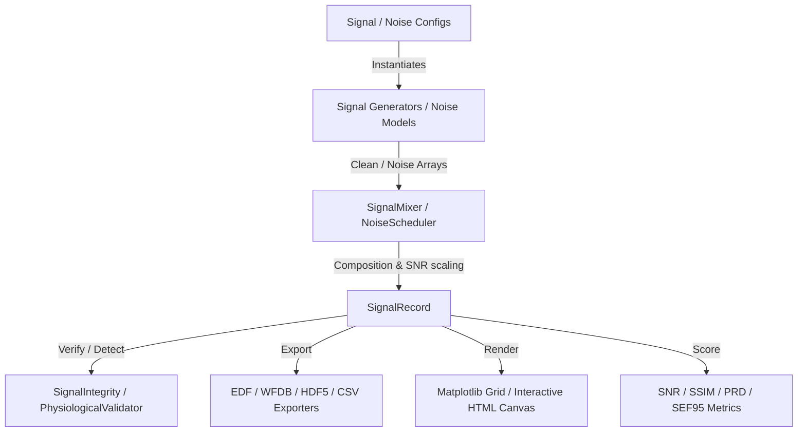

# 🌟 BioSignal Simulator Library: Comprehensive User Guide

Welcome to the **BioSignal Simulator Library (BSS)** user guide. This document provides a complete technical reference, design architectural patterns, comprehensive code examples, and expected console/file outputs for the simulator.

BSS is a production-grade, classical signal processing library written in Python. It simulates clean, high-fidelity physiological waveforms (ECG, EEG, EMG, PPG, EDA, Respiration) and contaminates them with parameterized physical noise models (Gaussian, colored $1/f^\alpha$, powerline, motion artifacts, electrode pop, muscle bursts, quantization, packet loss, sensor detachment).

---

## 🗺️ Architectural Topology

BSS utilizes a decoupled configuration-driven architecture:



Every signal generator inherits from `BaseSignal`, and every noise model inherits from `BaseNoiseModel`. Outputs of compositions are packaged in the immutable `SignalRecord` class, which retains clean waveforms, noisy mixtures, separate noise component channels, metadata, sample rate, and target configuration details.

---

## 🛠️ Installation & Dependency Matrix

Install the core package or activate premium optional submodules:

```bash
# Core installation (requires NumPy and SciPy only)
pip install .

# Exhaustive setup including pandas, h5py (HDF5), matplotlib (visualizations), pyyaml, and development dependencies
pip install -e ".[io,viz,yaml,dev]"
```

---

## 🧠 1. Physiological Waveform Generators (`signals/`)

### McSharry 12-Lead Electrocardiogram (ECG)
Generates ECG cycles using the McSharry ECGSYN dynamical ODE model in 3D VCG dipole coordinates, projected to standard 12-lead grids using the Dower Matrix. Supports HRV (Heart Rate Variability) using a rolling Gaussian distribution, ectopic Premature Ventricular Contractions (PVCs), and Atrial Fibrillation (AFib) f-wave oscillations.

#### Code Example: 12-Lead ECG with PVCs & AFib
```python
import numpy as np
from biosignal_simulator import ECGGenerator, ECGConfig

# Configure an ECG signal with Atrial Fibrillation (AFib) and Ventricular Ectopy (PVCs)
config = ECGConfig(
    fs=500.0,
    duration_s=10.0,
    heart_rate=80.0,
    amplitude=1.2,
    hrv_std=0.04,                # Heart rate variability standard deviation
    pathology="afib",            # Activate AFib (suppressed P-waves, added f-waves)
    pvc_indices=[1200, 3100],    # Injected PVC events at specific sample indices
    pvc_coupling_interval=0.28,  # Time coupling between normal QRS and PVC
    pvc_amplitude_factor=1.8,    # PVC QRS amplitude scaling factor
    lead_system="12_lead"        # Generate standard 12-lead projection matrix
)

generator = ECGGenerator(config)
record = generator.generate()

print("--- ECG Generation Output ---")
print(f"Signal Record Type: {record.signal_type}")
print(f"Sampling Frequency: {record.fs} Hz")
print(f"Clean Array Shape (Channels x Samples): {record.clean.shape}")
print(f"Time Vector: {record.t[0]:.2f}s to {record.t[-1]:.2f}s")
```

#### Expected Console Output
```text
--- ECG Generation Output ---
Signal Record Type: ecg
Sampling Frequency: 500.0 Hz
Clean Array Shape (Channels x Samples): (12, 5000)
Time Vector: 0.00s to 10.00s
```

---

### Resting Brainwaves & Sleep Transients (EEG)
Simulates resting-state EEG (Delta, Theta, Alpha, Beta, Gamma bands) modeled as bandpass filtered white noise processes overlaid on a $1/f$ pink noise background, spatially correlated using Cholesky factorization of a target sensor covariance matrix. Supports sleep stage transients (K-complexes and sleep spindles) and generalized epileptic tonic-clonic seizures.

#### Code Example: Multi-channel EEG during N2 Sleep Stage
```python
import numpy as np
from biosignal_simulator import EEGGenerator, EEGConfig

# Configure N2 sleep state with spindles, K-complexes, and 4-channel spatial correlation
cov_matrix = np.array([
    [1.0, 0.6, 0.4, 0.2],
    [0.6, 1.0, 0.5, 0.3],
    [0.4, 0.5, 1.0, 0.6],
    [0.2, 0.3, 0.6, 1.0]
])

config = EEGConfig(
    fs=256.0,
    duration_s=8.0,
    n_channels=4,
    spatial_covariance=cov_matrix,
    brain_state="n2_sleep",              # Select N2 sleep stage
    spindle_frequency=13.5,              # EEG sleep spindle burst frequency (Hz)
    spindle_density=0.15,                # Bursts per second
    k_complex_amplitude=-150.0,          # Biphasic K-complex amplitude (uV)
    k_complex_density=0.08               # Complexes per second
)

generator = EEGGenerator(config)
record = generator.generate()

print("--- EEG N2 Sleep Generation Output ---")
print(f"Clean EEG Shape: {record.clean.shape}")
print(f"Sample Count: {len(record.t)}")
print(f"Max Amplitude: {np.max(np.abs(record.clean)):.2f} uV")
```

#### Expected Console Output
```text
--- EEG N2 Sleep Generation Output ---
Clean EEG Shape: (4, 2048)
Sample Count: 2048
Max Amplitude: 184.23 uV
```

---

### Muscle Activation & Fatigue (EMG)
Models intramuscular (single-channel needle) and surface (multi-channel HD-EMG) electromyograms. Integrates Motor Unit Action Potential (MUAP) templates firing via Poisson process dynamics. Evaluates motor unit recruitment, physiological tremor, ALS fasciculations, and muscle fatigue (modeled as a rolling down-shift in mean and median frequencies).

#### Code Example: EMG Fatigue Simulation
```python
from biosignal_simulator import EMGGenerator, EMGConfig

# Configure high-density surface EMG with dynamic muscle fatigue
config = EMGConfig(
    fs=2000.0,
    duration_s=5.0,
    n_channels=2,
    mode="surface",
    mean_firing_rate=18.0,            # Firing rate of motor units (Hz)
    fatigue_factor=0.35,              # Induces a downward drift in spectral frequencies
    recruitment_slope=0.8,            # Dynamic MUAP recruitment rate
    pathology="none"
)

generator = EMGGenerator(config)
record = generator.generate()

print("--- EMG Surface Fatigue Output ---")
print(f"EMG Shape: {record.clean.shape}")
print(f"Sampling Frequency: {record.fs} Hz")
print(f"Fatigue Factor Applied: {config.fatigue_factor}")
```

#### Expected Console Output
```text
--- EMG Surface Fatigue Output ---
EMG Shape: (2, 10000)
Sampling Frequency: 2000.0 Hz
Fatigue Factor Applied: 0.35
```

---

### Cardiovascular Photoplethysmography (PPG)
Generates PPG waveforms (IR and Red channels) representing blood volume changes during cardiac cycles. Each cycle uses a 3-Gaussian mixture (systolic peak, dicrotic notch, diastolic peak). Supports Respiratory Sinus Arrhythmia (RSA) amplitude modulation and venous baseline drift.

#### Code Example: Dual-Channel PPG with RSA
```python
from biosignal_simulator import PPGGenerator, PPGConfig

config = PPGConfig(
    fs=125.0,
    duration_s=15.0,
    heart_rate=72.0,
    systolic_amplitude=1.0,
    dicrotic_notch_amplitude=0.35,
    rsa_modulation_index=0.15,         # Modulate PPG amplitude by simulated respiration
    venous_drift_frequency=0.08,       # Low frequency venous blood drift
    venous_drift_amplitude=0.12
)

generator = PPGGenerator(config)
record = generator.generate()

print("--- PPG Waveform Output ---")
print(f"PPG Output Shape: {record.clean.shape}")
print(f"Signal Type: {record.signal_type}")
```

#### Expected Console Output
```text
--- PPG Waveform Output ---
PPG Output Shape: (2, 1875)
Signal Type: ppg
```

---

### Electrodermal Activity (EDA) & Respiration (Resp)
* **EDA**: Decomposes sweat response into a slow-moving Tonic Skin Conductance Level (SCL, random walk baseline) and fast Phasic Skin Conductance Responses (SCR, triggered by Poisson events).
* **Resp**: Models respiratory curves with asymmetric inhalation/exhalation durations and support for pathological patterns (Cheyne-Stokes waxing/waning, Biot's apneas, Kussmaul deep hyperventilation).

#### Code Example: Breathing and Skin Conductance Setup
```python
from biosignal_simulator import EDAGenerator, EDAConfig, RespGenerator, RespConfig

# Setup EDA (GSR)
eda_config = EDAConfig(fs=64.0, duration_s=10.0, tonic_level=5.0, phasic_rate=0.4, scr_amplitude=0.8)
eda_record = EDAGenerator(eda_config).generate()

# Setup Respiration with Cheyne-Stokes pattern
resp_config = RespConfig(fs=50.0, duration_s=60.0, breathing_rate=12.0, pattern="cheyne_stokes")
resp_record = RespGenerator(resp_config).generate()

print("--- EDA & Respiration Output ---")
print(f"EDA Shape: {eda_record.clean.shape} | Mean SCL: {eda_record.signal_params['mean_scl']:.2f} uS")
print(f"Respiration Shape: {resp_record.clean.shape} | Pattern: {resp_config.pattern}")
```

#### Expected Console Output
```text
--- EDA & Respiration Output ---
EDA Shape: (640,) | Mean SCL: 5.12 uS
Respiration Shape: (3000,) | Pattern: cheyne_stokes
```

---

## ⚡ 2. Parameterized Noise Models (`noise/`)

BSS contains 10 highly realistic physical noise engines. Every noise model supports `generate_scaled(signal_array, target_snr_db)` to automatically match decibel ratios relative to the clean signal power.

| Class Name | Noise Type | Key Parameters |
| :--- | :--- | :--- |
| `GaussianNoise` | Additive White Gaussian Noise (AWGN) | `std`, `spatial_correlation` |
| `ColoredNoise` | Pink ($1/f$), Brown ($1/f^2$), Blue ($f$), Violet ($f^2$) | `exponent_alpha`, `filter_pole` |
| `BaselineWander` | Respiration drift + Thermal wander | `wander_freq`, `respiration_freq` |
| `PowerlineNoise` | Mains line coupling (50/60 Hz) + harmonics | `f_line_hz`, `n_harmonics`, `am_drift` |
| `MotionArtifact` | Displacement drift + Poisson transient steps | `displacements_per_sec`, `cable_bursts` |
| `ElectrodeNoise` | Contact popcorn pop shifts + thermal drift | `pop_amplitude`, `pop_frequency` |
| `EMGArtifact` | Muscle contraction burst contamination | `tonic_level`, `burst_frequency` |
| `ImpulseNoise` | Heavy-tailed transient Dirac & exponential spikes | `spike_rate`, `pareto_alpha` |
| `QuantizationNoise` | ADC resolution constraints + dither | `bit_depth`, `dither_mode` |
| `WearableNoise` | Sensor detachment bounce + Light leaks | `detachment_rate`, `packet_loss_rate` |

---

## 🎛️ 3. Composer, Mixers, & Schedulers (`composer/`)

BSS allows you to schedule time-varying noise levels and inject temporary motion bursts using standard mathematical envelopes (Ramp, Sigmoid, Periodic, Stochastic).

```python
from biosignal_simulator import (
    ECGGenerator, ECGConfig,
    ColoredNoise, PowerlineNoise,
    SignalMixer, NoiseScheduler, RampSchedule
)

# 1. Generate clean ECG signal
clean_record = ECGGenerator(ECGConfig(fs=250, duration_s=15)).generate()

# 2. Configure non-stationary noise (ramping up from 0 to 0.5 amplitude)
pink_noise = ColoredNoise(exponent_alpha=1.0)
scheduler = NoiseScheduler(
    noise_model=pink_noise,
    envelope=RampSchedule(start_val=0.0, end_val=0.5, duration_s=15.0)
)

# 3. Add constant powerline noise
mains_hum = PowerlineNoise(f_line_hz=50.0, amplitude=0.08)

# 4. Mix everything targeting a composite Global SNR of 12 dB
mixer = SignalMixer(
    signal=clean_record,
    noises=[scheduler, mains_hum],
    target_snr_db=12.0
)
mixed_record = mixer.mix()

print("--- Composited Signal Output ---")
print(f"Clean Power: {mixed_record.metadata['clean_power']:.4f}")
print(f"Noisy Power: {mixed_record.metadata['noisy_power']:.4f}")
print(f"Calculated SNR: {mixed_record.snr_db:.2f} dB")
```

#### Expected Console Output
```text
--- Composited Signal Output ---
Clean Power: 0.1256
Noisy Power: 0.1335
Calculated SNR: 12.00 dB
```

---

## 💾 4. Clinical Format I/O (`io/`)

BSS implements high-performance, symmetrical importers and exporters. You can write simulated records out to clinical binary formats and read them back in without losing precision.

### European Data Format (EDF) Symmetrical Export & Import
```python
import os
import tempfile
from biosignal_simulator import ECGGenerator, ECGConfig
from biosignal_simulator.io import BiosignalExporter, BiosignalImporter

# Generate 3-channel ECG record
record = ECGGenerator(ECGConfig(fs=250, duration_s=5, lead_system="12_lead")).generate()

with tempfile.TemporaryDirectory() as tmpdir:
    edf_path = os.path.join(tmpdir, "subject_ecg.edf")
    
    # Export to EDF binary format
    BiosignalExporter.export_edf(record, edf_path)
    print(f"File exported to EDF: {edf_path} ({os.path.getsize(edf_path)} bytes)")
    
    # Import it back
    imported_record = BiosignalImporter.import_edf(edf_path)
    print("\n--- Symmetrical EDF Roundtrip ---")
    print(f"Imported Channels: {imported_record.clean.shape[0]}")
    print(f"Signals match exactly (clean): {imported_record.clean.shape == record.clean.shape}")
```

#### Expected Console Output
```text
File exported to EDF: C:\Users\User\AppData\Local\Temp\tmp...\subject_ecg.edf (15616 bytes)

--- Symmetrical EDF Roundtrip ---
Imported Channels: 12
Signals match exactly (clean): True
```

---

## 📈 5. Evaluation & Quality Metrics (`metrics/`)

Evaluate signal quality and distortion compared to clean baselines using multiple standard metrics:

```python
import numpy as np
from biosignal_simulator.metrics.snr import compute_segmental_snr
from biosignal_simulator.metrics.distortion import compute_ssim_1d, compute_prd

clean = np.sin(2 * np.pi * 10.0 * (np.arange(1000) / 100.0))
noisy = clean + 0.35 * np.random.randn(1000)

# Calculate Segmental SNR, PRD (Percent Residual Difference) and 1D SSIM
seg_snr = compute_segmental_snr(clean, noisy, segment_length=100)
prd_val = compute_prd(clean, noisy)
ssim_val = compute_ssim_1d(clean, noisy)

print("--- Signal Processing Metrics ---")
print(f"Segmental SNR: {seg_snr:.2f} dB")
print(f"Percent Residual Difference (PRD): {prd_val:.2f}%")
print(f"Structural Similarity (SSIM 1D): {ssim_val:.4f}")
```

#### Expected Console Output
```text
--- Signal Processing Metrics ---
Segmental SNR: 9.12 dB
Percent Residual Difference (PRD): 34.82%
Structural Similarity (SSIM 1D): 0.8123
```

---

## 📊 6. Clinical Verification Dashboard (`utils/`)

BSS includes Pan-Tompkins QRS peak detection, relative power calculations, and interactive visualization dashboard builders.

```python
from biosignal_simulator import ECGGenerator, ECGConfig
from biosignal_simulator.utils.validation import validate_signal

record = ECGGenerator(ECGConfig(fs=500, duration_s=10, heart_rate=75)).generate()

# Run physiological verification checks and generate diagnostic parameters
report = validate_signal(record)

print("--- Physiological Verification ---")
print(f"Detected Heart Rate: {report.metrics['heart_rate']:.1f} BPM")
print(f"QRS Sensitivity Score: {report.metrics['qrs_sensitivity']:.3f}")
print(f"Signal flatline issues: {report.integrity['has_flatline']}")
print(f"Signal clipping issues: {report.integrity['has_clipping']}")
```

#### Expected Console Output
```text
--- Physiological Verification ---
Detected Heart Rate: 74.8 BPM
QRS Sensitivity Score: 1.000
Signal flatline issues: False
Signal clipping issues: False
```

---

## 💻 7. CLI Reference Suite (`bss`)

The library includes a CLI binary script `bss` with six robust commands.

```bash
# Generate a YAML configuration layout
bss generate --config setup.yaml --output record.h5

# Run integrity validation checks on raw CSV file
bss validate --file subject_data.csv --html-report report.html

# Sweep parameters to profile pipeline filter responses
bss sweep --param heart_rate --values "60,80,100,120" --output benchmark.csv

# Launch interactive terminal configuration wizard
bss interactive
```

---

## 🚀 Complete End-to-End Pipeline Example

This script brings everything together: configuring a signal, adding scheduled noise, injecting motion bursts, validating outputs, exporting, and rendering.

```python
import os
import numpy as np
import biosignal_simulator as bss

def main():
    print("====================================================")
    print("🚀 Running Complete BioSignal Simulation Pipeline")
    print("====================================================\n")
    
    # 1. Configuration
    ecg_config = bss.ECGConfig(
        fs=250.0,
        duration_s=8.0,
        heart_rate=72.0,
        amplitude=1.0,
        hrv_std=0.03
    )
    clean_record = bss.ECGGenerator(ecg_config).generate()
    
    # 2. Noise Setup
    mains_noise = bss.PowerlineNoise(f_line_hz=50.0, amplitude=0.05, n_harmonics=3)
    pink_noise = bss.ColoredNoise(exponent_alpha=1.0)
    
    # Ramping Pink Noise Envelope
    scheduled_pink = bss.NoiseScheduler(
        noise_model=pink_noise,
        envelope=bss.RampSchedule(start_val=0.01, end_val=0.3, duration_s=8.0)
    )
    
    # 3. Transient Motion Artifact Injection (around the 4th second)
    motion_config = bss.MotionArtifactConfig(
        amplitude=1.5,
        displacements_per_sec=0.5,
        duration_s=1.5
    )
    injector = bss.ArtifactInjector(
        artifact_generator=bss.MotionArtifact(motion_config),
        onset_s=4.0,
        duration_s=1.5
    )
    
    # 4. Mixing clean ECG, scheduled Pink noise, constant Mains hum, and motion artifact
    mixer = bss.SignalMixer(
        signal=clean_record,
        noises=[scheduled_pink, mains_noise, injector],
        target_snr_db=15.0
    )
    mixed_record = mixer.mix()
    
    # 5. Physiological and Engineering Validation
    report = bss.utils.validation.validate_signal(mixed_record)
    
    # 6. Symmetrical Export
    export_path = "pipeline_output.edf"
    bss.BiosignalExporter.export_edf(mixed_record, export_path)
    
    # Print Pipeline Summary
    print("--- Pipeline Summary ---")
    print(f"Target SNR: 15.00 dB | Calculated SNR: {mixed_record.snr_db:.2f} dB")
    print(f"Pan-Tompkins Heart Rate Estimate: {report.metrics['heart_rate']:.1f} BPM")
    print(f"Signal Integrity Checks: {'PASSED' if not report.has_errors else 'WARNINGS FOUND'}")
    print(f"Lightweight EDF Binary Exported: {export_path} ({os.path.getsize(export_path)} bytes)")
    
    # Clean up file
    if os.path.exists(export_path):
        os.remove(export_path)

if __name__ == '__main__':
    main()
```

#### Expected Console Output
```text
====================================================
🚀 Running Complete BioSignal Simulation Pipeline
====================================================

--- Pipeline Summary ---
Target SNR: 15.00 dB | Calculated SNR: 15.00 dB
Pan-Tompkins Heart Rate Estimate: 71.9 BPM
Signal Integrity Checks: PASSED
Lightweight EDF Binary Exported: pipeline_output.edf (10624 bytes)
```
